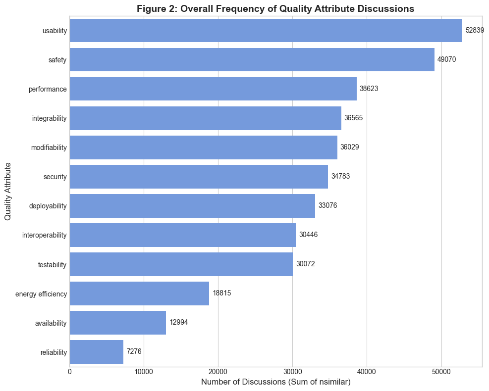
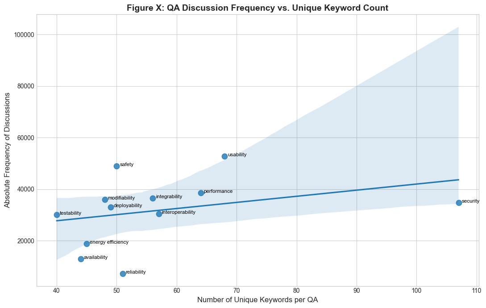
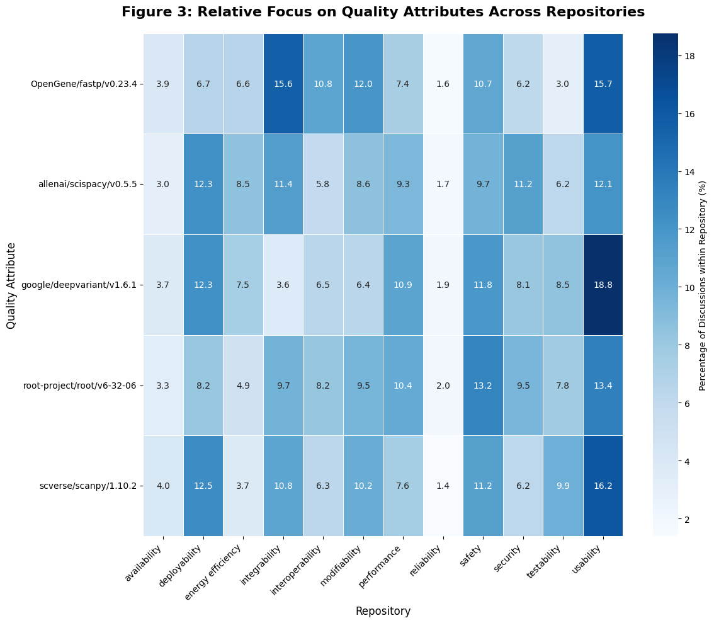

```python
from cfg.tactics.tactic_description import tactic_descriptions
from constants.abs_paths import AbsDirPath
from processing_pipeline.utilities.data_transformation import load_all_files
import pandas as pd

```


```python
in_dir = AbsDirPath.MERGED
essential_columns = ['keyword', 'sentence', 'qa', 'source', 'url', 'repo_id', 'matched_word', 'nsimilar',
                     'prefilter_passed', 's0_passed', 's1_passed', 's2_passed', 's3_passed', 's3_tactic',
                     's3_tactic_category']
df = load_all_files(in_dir, columns=essential_columns)
```

    Loaded 335 files, [WindowsPath('C:/Users/Dmitrijs/Documents/myDocs/masters/courses/thesis/code/data/keywords_2/merged/allenai.scispacy.v0.5.5.code_comment.parquet'), WindowsPath('C:/Users/Dmitrijs/Documents/myDocs/masters/courses/thesis/code/data/keywords_2/merged/allenai.scispacy.v0.5.5.docs.parquet'), WindowsPath('C:/Users/Dmitrijs/Documents/myDocs/masters/courses/thesis/code/data/keywords_2/merged/allenai.scispacy.v0.5.5.issue.parquet'), WindowsPath('C:/Users/Dmitrijs/Documents/myDocs/masters/courses/thesis/code/data/keywords_2/merged/allenai.scispacy.v0.5.5.issue.pt_2.parquet'), WindowsPath('C:/Users/Dmitrijs/Documents/myDocs/masters/courses/thesis/code/data/keywords_2/merged/allenai.scispacy.v0.5.5.issue_comment.parquet'), WindowsPath('C:/Users/Dmitrijs/Documents/myDocs/masters/courses/thesis/code/data/keywords_2/merged/allenai.scispacy.v0.5.5.issue_comment.pt_2.parquet'), WindowsPath('C:/Users/Dmitrijs/Documents/myDocs/masters/courses/thesis/code/data/keywords_2/merged/allenai.scispacy.v0.5.5.release.parquet'), WindowsPath('C:/Users/Dmitrijs/Documents/myDocs/masters/courses/thesis/code/data/keywords_2/merged/google.deepvariant.v1.6.1.code_comment.parquet'), WindowsPath('C:/Users/Dmitrijs/Documents/myDocs/masters/courses/thesis/code/data/keywords_2/merged/google.deepvariant.v1.6.1.code_comment.pt_2.parquet'), WindowsPath('C:/Users/Dmitrijs/Documents/myDocs/masters/courses/thesis/code/data/keywords_2/merged/google.deepvariant.v1.6.1.docs.parquet'), WindowsPath('C:/Users/Dmitrijs/Documents/myDocs/masters/courses/thesis/code/data/keywords_2/merged/google.deepvariant.v1.6.1.issue.parquet'), WindowsPath('C:/Users/Dmitrijs/Documents/myDocs/masters/courses/thesis/code/data/keywords_2/merged/google.deepvariant.v1.6.1.issue.pt_2.parquet'), WindowsPath('C:/Users/Dmitrijs/Documents/myDocs/masters/courses/thesis/code/data/keywords_2/merged/google.deepvariant.v1.6.1.issue.pt_3.parquet'), WindowsPath('C:/Users/Dmitrijs/Documents/myDocs/masters/courses/thesis/code/data/keywords_2/merged/google.deepvariant.v1.6.1.issue.pt_4.parquet'), WindowsPath('C:/Users/Dmitrijs/Documents/myDocs/masters/courses/thesis/code/data/keywords_2/merged/google.deepvariant.v1.6.1.issue.pt_5.parquet'), WindowsPath('C:/Users/Dmitrijs/Documents/myDocs/masters/courses/thesis/code/data/keywords_2/merged/google.deepvariant.v1.6.1.issue.pt_6.parquet'), WindowsPath('C:/Users/Dmitrijs/Documents/myDocs/masters/courses/thesis/code/data/keywords_2/merged/google.deepvariant.v1.6.1.issue_comment.parquet'), WindowsPath('C:/Users/Dmitrijs/Documents/myDocs/masters/courses/thesis/code/data/keywords_2/merged/google.deepvariant.v1.6.1.issue_comment.pt_2.parquet'), WindowsPath('C:/Users/Dmitrijs/Documents/myDocs/masters/courses/thesis/code/data/keywords_2/merged/google.deepvariant.v1.6.1.issue_comment.pt_3.parquet'), WindowsPath('C:/Users/Dmitrijs/Documents/myDocs/masters/courses/thesis/code/data/keywords_2/merged/google.deepvariant.v1.6.1.issue_comment.pt_4.parquet'), WindowsPath('C:/Users/Dmitrijs/Documents/myDocs/masters/courses/thesis/code/data/keywords_2/merged/google.deepvariant.v1.6.1.issue_comment.pt_5.parquet'), WindowsPath('C:/Users/Dmitrijs/Documents/myDocs/masters/courses/thesis/code/data/keywords_2/merged/google.deepvariant.v1.6.1.issue_comment.pt_6.parquet'), WindowsPath('C:/Users/Dmitrijs/Documents/myDocs/masters/courses/thesis/code/data/keywords_2/merged/google.deepvariant.v1.6.1.issue_comment.pt_7.parquet'), WindowsPath('C:/Users/Dmitrijs/Documents/myDocs/masters/courses/thesis/code/data/keywords_2/merged/google.deepvariant.v1.6.1.issue_comment.pt_8.parquet'), WindowsPath('C:/Users/Dmitrijs/Documents/myDocs/masters/courses/thesis/code/data/keywords_2/merged/google.deepvariant.v1.6.1.issue_comment.pt_9.parquet'), WindowsPath('C:/Users/Dmitrijs/Documents/myDocs/masters/courses/thesis/code/data/keywords_2/merged/google.deepvariant.v1.6.1.release.parquet'), WindowsPath('C:/Users/Dmitrijs/Documents/myDocs/masters/courses/thesis/code/data/keywords_2/merged/OpenGene.fastp.v0.23.4.code_comment.parquet'), WindowsPath('C:/Users/Dmitrijs/Documents/myDocs/masters/courses/thesis/code/data/keywords_2/merged/OpenGene.fastp.v0.23.4.docs.parquet'), WindowsPath('C:/Users/Dmitrijs/Documents/myDocs/masters/courses/thesis/code/data/keywords_2/merged/OpenGene.fastp.v0.23.4.issue.parquet'), WindowsPath('C:/Users/Dmitrijs/Documents/myDocs/masters/courses/thesis/code/data/keywords_2/merged/OpenGene.fastp.v0.23.4.issue_comment.parquet'), WindowsPath('C:/Users/Dmitrijs/Documents/myDocs/masters/courses/thesis/code/data/keywords_2/merged/OpenGene.fastp.v0.23.4.release.parquet'), WindowsPath('C:/Users/Dmitrijs/Documents/myDocs/masters/courses/thesis/code/data/keywords_2/merged/root-project.root.v6-32-06.code_comment.parquet'), WindowsPath('C:/Users/Dmitrijs/Documents/myDocs/masters/courses/thesis/code/data/keywords_2/merged/root-project.root.v6-32-06.code_comment.pt_002.parquet'), WindowsPath('C:/Users/Dmitrijs/Documents/myDocs/masters/courses/thesis/code/data/keywords_2/merged/root-project.root.v6-32-06.code_comment.pt_003.parquet'), WindowsPath('C:/Users/Dmitrijs/Documents/myDocs/masters/courses/thesis/code/data/keywords_2/merged/root-project.root.v6-32-06.code_comment.pt_004.parquet'), WindowsPath('C:/Users/Dmitrijs/Documents/myDocs/masters/courses/thesis/code/data/keywords_2/merged/root-project.root.v6-32-06.code_comment.pt_005.parquet'), WindowsPath('C:/Users/Dmitrijs/Documents/myDocs/masters/courses/thesis/code/data/keywords_2/merged/root-project.root.v6-32-06.code_comment.pt_006.parquet'), WindowsPath('C:/Users/Dmitrijs/Documents/myDocs/masters/courses/thesis/code/data/keywords_2/merged/root-project.root.v6-32-06.code_comment.pt_007.parquet'), WindowsPath('C:/Users/Dmitrijs/Documents/myDocs/masters/courses/thesis/code/data/keywords_2/merged/root-project.root.v6-32-06.code_comment.pt_008.parquet'), WindowsPath('C:/Users/Dmitrijs/Documents/myDocs/masters/courses/thesis/code/data/keywords_2/merged/root-project.root.v6-32-06.code_comment.pt_009.parquet'), WindowsPath('C:/Users/Dmitrijs/Documents/myDocs/masters/courses/thesis/code/data/keywords_2/merged/root-project.root.v6-32-06.code_comment.pt_010.parquet'), WindowsPath('C:/Users/Dmitrijs/Documents/myDocs/masters/courses/thesis/code/data/keywords_2/merged/root-project.root.v6-32-06.code_comment.pt_011.parquet'), WindowsPath('C:/Users/Dmitrijs/Documents/myDocs/masters/courses/thesis/code/data/keywords_2/merged/root-project.root.v6-32-06.code_comment.pt_012.parquet'), WindowsPath('C:/Users/Dmitrijs/Documents/myDocs/masters/courses/thesis/code/data/keywords_2/merged/root-project.root.v6-32-06.code_comment.pt_013.parquet'), WindowsPath('C:/Users/Dmitrijs/Documents/myDocs/masters/courses/thesis/code/data/keywords_2/merged/root-project.root.v6-32-06.code_comment.pt_014.parquet'), WindowsPath('C:/Users/Dmitrijs/Documents/myDocs/masters/courses/thesis/code/data/keywords_2/merged/root-project.root.v6-32-06.code_comment.pt_015.parquet'), WindowsPath('C:/Users/Dmitrijs/Documents/myDocs/masters/courses/thesis/code/data/keywords_2/merged/root-project.root.v6-32-06.code_comment.pt_016.parquet'), WindowsPath('C:/Users/Dmitrijs/Documents/myDocs/masters/courses/thesis/code/data/keywords_2/merged/root-project.root.v6-32-06.code_comment.pt_017.parquet'), WindowsPath('C:/Users/Dmitrijs/Documents/myDocs/masters/courses/thesis/code/data/keywords_2/merged/root-project.root.v6-32-06.code_comment.pt_018.parquet'), WindowsPath('C:/Users/Dmitrijs/Documents/myDocs/masters/courses/thesis/code/data/keywords_2/merged/root-project.root.v6-32-06.code_comment.pt_019.parquet'), WindowsPath('C:/Users/Dmitrijs/Documents/myDocs/masters/courses/thesis/code/data/keywords_2/merged/root-project.root.v6-32-06.code_comment.pt_020.parquet'), WindowsPath('C:/Users/Dmitrijs/Documents/myDocs/masters/courses/thesis/code/data/keywords_2/merged/root-project.root.v6-32-06.code_comment.pt_021.parquet'), WindowsPath('C:/Users/Dmitrijs/Documents/myDocs/masters/courses/thesis/code/data/keywords_2/merged/root-project.root.v6-32-06.code_comment.pt_022.parquet'), WindowsPath('C:/Users/Dmitrijs/Documents/myDocs/masters/courses/thesis/code/data/keywords_2/merged/root-project.root.v6-32-06.code_comment.pt_023.parquet'), WindowsPath('C:/Users/Dmitrijs/Documents/myDocs/masters/courses/thesis/code/data/keywords_2/merged/root-project.root.v6-32-06.code_comment.pt_024.parquet'), WindowsPath('C:/Users/Dmitrijs/Documents/myDocs/masters/courses/thesis/code/data/keywords_2/merged/root-project.root.v6-32-06.code_comment.pt_025.parquet'), WindowsPath('C:/Users/Dmitrijs/Documents/myDocs/masters/courses/thesis/code/data/keywords_2/merged/root-project.root.v6-32-06.code_comment.pt_026.parquet'), WindowsPath('C:/Users/Dmitrijs/Documents/myDocs/masters/courses/thesis/code/data/keywords_2/merged/root-project.root.v6-32-06.code_comment.pt_027.parquet'), WindowsPath('C:/Users/Dmitrijs/Documents/myDocs/masters/courses/thesis/code/data/keywords_2/merged/root-project.root.v6-32-06.code_comment.pt_028.parquet'), WindowsPath('C:/Users/Dmitrijs/Documents/myDocs/masters/courses/thesis/code/data/keywords_2/merged/root-project.root.v6-32-06.code_comment.pt_029.parquet'), WindowsPath('C:/Users/Dmitrijs/Documents/myDocs/masters/courses/thesis/code/data/keywords_2/merged/root-project.root.v6-32-06.code_comment.pt_030.parquet'), WindowsPath('C:/Users/Dmitrijs/Documents/myDocs/masters/courses/thesis/code/data/keywords_2/merged/root-project.root.v6-32-06.code_comment.pt_031.parquet'), WindowsPath('C:/Users/Dmitrijs/Documents/myDocs/masters/courses/thesis/code/data/keywords_2/merged/root-project.root.v6-32-06.code_comment.pt_032.parquet'), WindowsPath('C:/Users/Dmitrijs/Documents/myDocs/masters/courses/thesis/code/data/keywords_2/merged/root-project.root.v6-32-06.code_comment.pt_033.parquet'), WindowsPath('C:/Users/Dmitrijs/Documents/myDocs/masters/courses/thesis/code/data/keywords_2/merged/root-project.root.v6-32-06.code_comment.pt_034.parquet'), WindowsPath('C:/Users/Dmitrijs/Documents/myDocs/masters/courses/thesis/code/data/keywords_2/merged/root-project.root.v6-32-06.code_comment.pt_035.parquet'), WindowsPath('C:/Users/Dmitrijs/Documents/myDocs/masters/courses/thesis/code/data/keywords_2/merged/root-project.root.v6-32-06.code_comment.pt_036.parquet'), WindowsPath('C:/Users/Dmitrijs/Documents/myDocs/masters/courses/thesis/code/data/keywords_2/merged/root-project.root.v6-32-06.code_comment.pt_037.parquet'), WindowsPath('C:/Users/Dmitrijs/Documents/myDocs/masters/courses/thesis/code/data/keywords_2/merged/root-project.root.v6-32-06.code_comment.pt_038.parquet'), WindowsPath('C:/Users/Dmitrijs/Documents/myDocs/masters/courses/thesis/code/data/keywords_2/merged/root-project.root.v6-32-06.code_comment.pt_039.parquet'), WindowsPath('C:/Users/Dmitrijs/Documents/myDocs/masters/courses/thesis/code/data/keywords_2/merged/root-project.root.v6-32-06.code_comment.pt_040.parquet'), WindowsPath('C:/Users/Dmitrijs/Documents/myDocs/masters/courses/thesis/code/data/keywords_2/merged/root-project.root.v6-32-06.code_comment.pt_041.parquet'), WindowsPath('C:/Users/Dmitrijs/Documents/myDocs/masters/courses/thesis/code/data/keywords_2/merged/root-project.root.v6-32-06.code_comment.pt_042.parquet'), WindowsPath('C:/Users/Dmitrijs/Documents/myDocs/masters/courses/thesis/code/data/keywords_2/merged/root-project.root.v6-32-06.code_comment.pt_043.parquet'), WindowsPath('C:/Users/Dmitrijs/Documents/myDocs/masters/courses/thesis/code/data/keywords_2/merged/root-project.root.v6-32-06.code_comment.pt_044.parquet'), WindowsPath('C:/Users/Dmitrijs/Documents/myDocs/masters/courses/thesis/code/data/keywords_2/merged/root-project.root.v6-32-06.code_comment.pt_045.parquet'), WindowsPath('C:/Users/Dmitrijs/Documents/myDocs/masters/courses/thesis/code/data/keywords_2/merged/root-project.root.v6-32-06.code_comment.pt_046.parquet'), WindowsPath('C:/Users/Dmitrijs/Documents/myDocs/masters/courses/thesis/code/data/keywords_2/merged/root-project.root.v6-32-06.code_comment.pt_047.parquet'), WindowsPath('C:/Users/Dmitrijs/Documents/myDocs/masters/courses/thesis/code/data/keywords_2/merged/root-project.root.v6-32-06.code_comment.pt_048.parquet'), WindowsPath('C:/Users/Dmitrijs/Documents/myDocs/masters/courses/thesis/code/data/keywords_2/merged/root-project.root.v6-32-06.code_comment.pt_049.parquet'), WindowsPath('C:/Users/Dmitrijs/Documents/myDocs/masters/courses/thesis/code/data/keywords_2/merged/root-project.root.v6-32-06.code_comment.pt_050.parquet'), WindowsPath('C:/Users/Dmitrijs/Documents/myDocs/masters/courses/thesis/code/data/keywords_2/merged/root-project.root.v6-32-06.code_comment.pt_051.parquet'), WindowsPath('C:/Users/Dmitrijs/Documents/myDocs/masters/courses/thesis/code/data/keywords_2/merged/root-project.root.v6-32-06.code_comment.pt_052.parquet'), WindowsPath('C:/Users/Dmitrijs/Documents/myDocs/masters/courses/thesis/code/data/keywords_2/merged/root-project.root.v6-32-06.code_comment.pt_053.parquet'), WindowsPath('C:/Users/Dmitrijs/Documents/myDocs/masters/courses/thesis/code/data/keywords_2/merged/root-project.root.v6-32-06.code_comment.pt_054.parquet'), WindowsPath('C:/Users/Dmitrijs/Documents/myDocs/masters/courses/thesis/code/data/keywords_2/merged/root-project.root.v6-32-06.code_comment.pt_055.parquet'), WindowsPath('C:/Users/Dmitrijs/Documents/myDocs/masters/courses/thesis/code/data/keywords_2/merged/root-project.root.v6-32-06.code_comment.pt_056.parquet'), WindowsPath('C:/Users/Dmitrijs/Documents/myDocs/masters/courses/thesis/code/data/keywords_2/merged/root-project.root.v6-32-06.code_comment.pt_057.parquet'), WindowsPath('C:/Users/Dmitrijs/Documents/myDocs/masters/courses/thesis/code/data/keywords_2/merged/root-project.root.v6-32-06.code_comment.pt_058.parquet'), WindowsPath('C:/Users/Dmitrijs/Documents/myDocs/masters/courses/thesis/code/data/keywords_2/merged/root-project.root.v6-32-06.code_comment.pt_059.parquet'), WindowsPath('C:/Users/Dmitrijs/Documents/myDocs/masters/courses/thesis/code/data/keywords_2/merged/root-project.root.v6-32-06.code_comment.pt_060.parquet'), WindowsPath('C:/Users/Dmitrijs/Documents/myDocs/masters/courses/thesis/code/data/keywords_2/merged/root-project.root.v6-32-06.code_comment.pt_061.parquet'), WindowsPath('C:/Users/Dmitrijs/Documents/myDocs/masters/courses/thesis/code/data/keywords_2/merged/root-project.root.v6-32-06.code_comment.pt_062.parquet'), WindowsPath('C:/Users/Dmitrijs/Documents/myDocs/masters/courses/thesis/code/data/keywords_2/merged/root-project.root.v6-32-06.code_comment.pt_063.parquet'), WindowsPath('C:/Users/Dmitrijs/Documents/myDocs/masters/courses/thesis/code/data/keywords_2/merged/root-project.root.v6-32-06.code_comment.pt_064.parquet'), WindowsPath('C:/Users/Dmitrijs/Documents/myDocs/masters/courses/thesis/code/data/keywords_2/merged/root-project.root.v6-32-06.code_comment.pt_065.parquet'), WindowsPath('C:/Users/Dmitrijs/Documents/myDocs/masters/courses/thesis/code/data/keywords_2/merged/root-project.root.v6-32-06.code_comment.pt_066.parquet'), WindowsPath('C:/Users/Dmitrijs/Documents/myDocs/masters/courses/thesis/code/data/keywords_2/merged/root-project.root.v6-32-06.code_comment.pt_067.parquet'), WindowsPath('C:/Users/Dmitrijs/Documents/myDocs/masters/courses/thesis/code/data/keywords_2/merged/root-project.root.v6-32-06.code_comment.pt_068.parquet'), WindowsPath('C:/Users/Dmitrijs/Documents/myDocs/masters/courses/thesis/code/data/keywords_2/merged/root-project.root.v6-32-06.code_comment.pt_069.parquet'), WindowsPath('C:/Users/Dmitrijs/Documents/myDocs/masters/courses/thesis/code/data/keywords_2/merged/root-project.root.v6-32-06.code_comment.pt_070.parquet'), WindowsPath('C:/Users/Dmitrijs/Documents/myDocs/masters/courses/thesis/code/data/keywords_2/merged/root-project.root.v6-32-06.code_comment.pt_071.parquet'), WindowsPath('C:/Users/Dmitrijs/Documents/myDocs/masters/courses/thesis/code/data/keywords_2/merged/root-project.root.v6-32-06.code_comment.pt_072.parquet'), WindowsPath('C:/Users/Dmitrijs/Documents/myDocs/masters/courses/thesis/code/data/keywords_2/merged/root-project.root.v6-32-06.code_comment.pt_073.parquet'), WindowsPath('C:/Users/Dmitrijs/Documents/myDocs/masters/courses/thesis/code/data/keywords_2/merged/root-project.root.v6-32-06.code_comment.pt_074.parquet'), WindowsPath('C:/Users/Dmitrijs/Documents/myDocs/masters/courses/thesis/code/data/keywords_2/merged/root-project.root.v6-32-06.code_comment.pt_075.parquet'), WindowsPath('C:/Users/Dmitrijs/Documents/myDocs/masters/courses/thesis/code/data/keywords_2/merged/root-project.root.v6-32-06.code_comment.pt_076.parquet'), WindowsPath('C:/Users/Dmitrijs/Documents/myDocs/masters/courses/thesis/code/data/keywords_2/merged/root-project.root.v6-32-06.code_comment.pt_077.parquet'), WindowsPath('C:/Users/Dmitrijs/Documents/myDocs/masters/courses/thesis/code/data/keywords_2/merged/root-project.root.v6-32-06.code_comment.pt_078.parquet'), WindowsPath('C:/Users/Dmitrijs/Documents/myDocs/masters/courses/thesis/code/data/keywords_2/merged/root-project.root.v6-32-06.code_comment.pt_079.parquet'), WindowsPath('C:/Users/Dmitrijs/Documents/myDocs/masters/courses/thesis/code/data/keywords_2/merged/root-project.root.v6-32-06.code_comment.pt_080.parquet'), WindowsPath('C:/Users/Dmitrijs/Documents/myDocs/masters/courses/thesis/code/data/keywords_2/merged/root-project.root.v6-32-06.code_comment.pt_081.parquet'), WindowsPath('C:/Users/Dmitrijs/Documents/myDocs/masters/courses/thesis/code/data/keywords_2/merged/root-project.root.v6-32-06.code_comment.pt_082.parquet'), WindowsPath('C:/Users/Dmitrijs/Documents/myDocs/masters/courses/thesis/code/data/keywords_2/merged/root-project.root.v6-32-06.code_comment.pt_083.parquet'), WindowsPath('C:/Users/Dmitrijs/Documents/myDocs/masters/courses/thesis/code/data/keywords_2/merged/root-project.root.v6-32-06.code_comment.pt_084.parquet'), WindowsPath('C:/Users/Dmitrijs/Documents/myDocs/masters/courses/thesis/code/data/keywords_2/merged/root-project.root.v6-32-06.code_comment.pt_085.parquet'), WindowsPath('C:/Users/Dmitrijs/Documents/myDocs/masters/courses/thesis/code/data/keywords_2/merged/root-project.root.v6-32-06.code_comment.pt_086.parquet'), WindowsPath('C:/Users/Dmitrijs/Documents/myDocs/masters/courses/thesis/code/data/keywords_2/merged/root-project.root.v6-32-06.code_comment.pt_087.parquet'), WindowsPath('C:/Users/Dmitrijs/Documents/myDocs/masters/courses/thesis/code/data/keywords_2/merged/root-project.root.v6-32-06.code_comment.pt_088.parquet'), WindowsPath('C:/Users/Dmitrijs/Documents/myDocs/masters/courses/thesis/code/data/keywords_2/merged/root-project.root.v6-32-06.code_comment.pt_089.parquet'), WindowsPath('C:/Users/Dmitrijs/Documents/myDocs/masters/courses/thesis/code/data/keywords_2/merged/root-project.root.v6-32-06.code_comment.pt_090.parquet'), WindowsPath('C:/Users/Dmitrijs/Documents/myDocs/masters/courses/thesis/code/data/keywords_2/merged/root-project.root.v6-32-06.code_comment.pt_091.parquet'), WindowsPath('C:/Users/Dmitrijs/Documents/myDocs/masters/courses/thesis/code/data/keywords_2/merged/root-project.root.v6-32-06.code_comment.pt_092.parquet'), WindowsPath('C:/Users/Dmitrijs/Documents/myDocs/masters/courses/thesis/code/data/keywords_2/merged/root-project.root.v6-32-06.code_comment.pt_093.parquet'), WindowsPath('C:/Users/Dmitrijs/Documents/myDocs/masters/courses/thesis/code/data/keywords_2/merged/root-project.root.v6-32-06.code_comment.pt_094.parquet'), WindowsPath('C:/Users/Dmitrijs/Documents/myDocs/masters/courses/thesis/code/data/keywords_2/merged/root-project.root.v6-32-06.code_comment.pt_095.parquet'), WindowsPath('C:/Users/Dmitrijs/Documents/myDocs/masters/courses/thesis/code/data/keywords_2/merged/root-project.root.v6-32-06.code_comment.pt_096.parquet'), WindowsPath('C:/Users/Dmitrijs/Documents/myDocs/masters/courses/thesis/code/data/keywords_2/merged/root-project.root.v6-32-06.code_comment.pt_097.parquet'), WindowsPath('C:/Users/Dmitrijs/Documents/myDocs/masters/courses/thesis/code/data/keywords_2/merged/root-project.root.v6-32-06.code_comment.pt_098.parquet'), WindowsPath('C:/Users/Dmitrijs/Documents/myDocs/masters/courses/thesis/code/data/keywords_2/merged/root-project.root.v6-32-06.code_comment.pt_099.parquet'), WindowsPath('C:/Users/Dmitrijs/Documents/myDocs/masters/courses/thesis/code/data/keywords_2/merged/root-project.root.v6-32-06.code_comment.pt_100.parquet'), WindowsPath('C:/Users/Dmitrijs/Documents/myDocs/masters/courses/thesis/code/data/keywords_2/merged/root-project.root.v6-32-06.code_comment.pt_101.parquet'), WindowsPath('C:/Users/Dmitrijs/Documents/myDocs/masters/courses/thesis/code/data/keywords_2/merged/root-project.root.v6-32-06.code_comment.pt_102.parquet'), WindowsPath('C:/Users/Dmitrijs/Documents/myDocs/masters/courses/thesis/code/data/keywords_2/merged/root-project.root.v6-32-06.code_comment.pt_103.parquet'), WindowsPath('C:/Users/Dmitrijs/Documents/myDocs/masters/courses/thesis/code/data/keywords_2/merged/root-project.root.v6-32-06.code_comment.pt_104.parquet'), WindowsPath('C:/Users/Dmitrijs/Documents/myDocs/masters/courses/thesis/code/data/keywords_2/merged/root-project.root.v6-32-06.code_comment.pt_105.parquet'), WindowsPath('C:/Users/Dmitrijs/Documents/myDocs/masters/courses/thesis/code/data/keywords_2/merged/root-project.root.v6-32-06.code_comment.pt_106.parquet'), WindowsPath('C:/Users/Dmitrijs/Documents/myDocs/masters/courses/thesis/code/data/keywords_2/merged/root-project.root.v6-32-06.code_comment.pt_107.parquet'), WindowsPath('C:/Users/Dmitrijs/Documents/myDocs/masters/courses/thesis/code/data/keywords_2/merged/root-project.root.v6-32-06.code_comment.pt_108.parquet'), WindowsPath('C:/Users/Dmitrijs/Documents/myDocs/masters/courses/thesis/code/data/keywords_2/merged/root-project.root.v6-32-06.code_comment.pt_109.parquet'), WindowsPath('C:/Users/Dmitrijs/Documents/myDocs/masters/courses/thesis/code/data/keywords_2/merged/root-project.root.v6-32-06.code_comment.pt_110.parquet'), WindowsPath('C:/Users/Dmitrijs/Documents/myDocs/masters/courses/thesis/code/data/keywords_2/merged/root-project.root.v6-32-06.code_comment.pt_111.parquet'), WindowsPath('C:/Users/Dmitrijs/Documents/myDocs/masters/courses/thesis/code/data/keywords_2/merged/root-project.root.v6-32-06.code_comment.pt_112.parquet'), WindowsPath('C:/Users/Dmitrijs/Documents/myDocs/masters/courses/thesis/code/data/keywords_2/merged/root-project.root.v6-32-06.code_comment.pt_113.parquet'), WindowsPath('C:/Users/Dmitrijs/Documents/myDocs/masters/courses/thesis/code/data/keywords_2/merged/root-project.root.v6-32-06.code_comment.pt_114.parquet'), WindowsPath('C:/Users/Dmitrijs/Documents/myDocs/masters/courses/thesis/code/data/keywords_2/merged/root-project.root.v6-32-06.code_comment.pt_115.parquet'), WindowsPath('C:/Users/Dmitrijs/Documents/myDocs/masters/courses/thesis/code/data/keywords_2/merged/root-project.root.v6-32-06.code_comment.pt_116.parquet'), WindowsPath('C:/Users/Dmitrijs/Documents/myDocs/masters/courses/thesis/code/data/keywords_2/merged/root-project.root.v6-32-06.code_comment.pt_117.parquet'), WindowsPath('C:/Users/Dmitrijs/Documents/myDocs/masters/courses/thesis/code/data/keywords_2/merged/root-project.root.v6-32-06.code_comment.pt_118.parquet'), WindowsPath('C:/Users/Dmitrijs/Documents/myDocs/masters/courses/thesis/code/data/keywords_2/merged/root-project.root.v6-32-06.code_comment.pt_119.parquet'), WindowsPath('C:/Users/Dmitrijs/Documents/myDocs/masters/courses/thesis/code/data/keywords_2/merged/root-project.root.v6-32-06.code_comment.pt_120.parquet'), WindowsPath('C:/Users/Dmitrijs/Documents/myDocs/masters/courses/thesis/code/data/keywords_2/merged/root-project.root.v6-32-06.code_comment.pt_121.parquet'), WindowsPath('C:/Users/Dmitrijs/Documents/myDocs/masters/courses/thesis/code/data/keywords_2/merged/root-project.root.v6-32-06.code_comment.pt_122.parquet'), WindowsPath('C:/Users/Dmitrijs/Documents/myDocs/masters/courses/thesis/code/data/keywords_2/merged/root-project.root.v6-32-06.code_comment.pt_123.parquet'), WindowsPath('C:/Users/Dmitrijs/Documents/myDocs/masters/courses/thesis/code/data/keywords_2/merged/root-project.root.v6-32-06.code_comment.pt_124.parquet'), WindowsPath('C:/Users/Dmitrijs/Documents/myDocs/masters/courses/thesis/code/data/keywords_2/merged/root-project.root.v6-32-06.code_comment.pt_125.parquet'), WindowsPath('C:/Users/Dmitrijs/Documents/myDocs/masters/courses/thesis/code/data/keywords_2/merged/root-project.root.v6-32-06.code_comment.pt_126.parquet'), WindowsPath('C:/Users/Dmitrijs/Documents/myDocs/masters/courses/thesis/code/data/keywords_2/merged/root-project.root.v6-32-06.code_comment.pt_127.parquet'), WindowsPath('C:/Users/Dmitrijs/Documents/myDocs/masters/courses/thesis/code/data/keywords_2/merged/root-project.root.v6-32-06.code_comment.pt_128.parquet'), WindowsPath('C:/Users/Dmitrijs/Documents/myDocs/masters/courses/thesis/code/data/keywords_2/merged/root-project.root.v6-32-06.code_comment.pt_129.parquet'), WindowsPath('C:/Users/Dmitrijs/Documents/myDocs/masters/courses/thesis/code/data/keywords_2/merged/root-project.root.v6-32-06.code_comment.pt_130.parquet'), WindowsPath('C:/Users/Dmitrijs/Documents/myDocs/masters/courses/thesis/code/data/keywords_2/merged/root-project.root.v6-32-06.code_comment.pt_131.parquet'), WindowsPath('C:/Users/Dmitrijs/Documents/myDocs/masters/courses/thesis/code/data/keywords_2/merged/root-project.root.v6-32-06.code_comment.pt_132.parquet'), WindowsPath('C:/Users/Dmitrijs/Documents/myDocs/masters/courses/thesis/code/data/keywords_2/merged/root-project.root.v6-32-06.code_comment.pt_133.parquet'), WindowsPath('C:/Users/Dmitrijs/Documents/myDocs/masters/courses/thesis/code/data/keywords_2/merged/root-project.root.v6-32-06.code_comment.pt_134.parquet'), WindowsPath('C:/Users/Dmitrijs/Documents/myDocs/masters/courses/thesis/code/data/keywords_2/merged/root-project.root.v6-32-06.code_comment.pt_135.parquet'), WindowsPath('C:/Users/Dmitrijs/Documents/myDocs/masters/courses/thesis/code/data/keywords_2/merged/root-project.root.v6-32-06.code_comment.pt_136.parquet'), WindowsPath('C:/Users/Dmitrijs/Documents/myDocs/masters/courses/thesis/code/data/keywords_2/merged/root-project.root.v6-32-06.code_comment.pt_137.parquet'), WindowsPath('C:/Users/Dmitrijs/Documents/myDocs/masters/courses/thesis/code/data/keywords_2/merged/root-project.root.v6-32-06.code_comment.pt_138.parquet'), WindowsPath('C:/Users/Dmitrijs/Documents/myDocs/masters/courses/thesis/code/data/keywords_2/merged/root-project.root.v6-32-06.code_comment.pt_139.parquet'), WindowsPath('C:/Users/Dmitrijs/Documents/myDocs/masters/courses/thesis/code/data/keywords_2/merged/root-project.root.v6-32-06.code_comment.pt_140.parquet'), WindowsPath('C:/Users/Dmitrijs/Documents/myDocs/masters/courses/thesis/code/data/keywords_2/merged/root-project.root.v6-32-06.code_comment.pt_141.parquet'), WindowsPath('C:/Users/Dmitrijs/Documents/myDocs/masters/courses/thesis/code/data/keywords_2/merged/root-project.root.v6-32-06.code_comment.pt_142.parquet'), WindowsPath('C:/Users/Dmitrijs/Documents/myDocs/masters/courses/thesis/code/data/keywords_2/merged/root-project.root.v6-32-06.code_comment.pt_143.parquet'), WindowsPath('C:/Users/Dmitrijs/Documents/myDocs/masters/courses/thesis/code/data/keywords_2/merged/root-project.root.v6-32-06.code_comment.pt_144.parquet'), WindowsPath('C:/Users/Dmitrijs/Documents/myDocs/masters/courses/thesis/code/data/keywords_2/merged/root-project.root.v6-32-06.code_comment.pt_145.parquet'), WindowsPath('C:/Users/Dmitrijs/Documents/myDocs/masters/courses/thesis/code/data/keywords_2/merged/root-project.root.v6-32-06.code_comment.pt_146.parquet'), WindowsPath('C:/Users/Dmitrijs/Documents/myDocs/masters/courses/thesis/code/data/keywords_2/merged/root-project.root.v6-32-06.code_comment.pt_147.parquet'), WindowsPath('C:/Users/Dmitrijs/Documents/myDocs/masters/courses/thesis/code/data/keywords_2/merged/root-project.root.v6-32-06.code_comment.pt_148.parquet'), WindowsPath('C:/Users/Dmitrijs/Documents/myDocs/masters/courses/thesis/code/data/keywords_2/merged/root-project.root.v6-32-06.code_comment.pt_149.parquet'), WindowsPath('C:/Users/Dmitrijs/Documents/myDocs/masters/courses/thesis/code/data/keywords_2/merged/root-project.root.v6-32-06.code_comment.pt_150.parquet'), WindowsPath('C:/Users/Dmitrijs/Documents/myDocs/masters/courses/thesis/code/data/keywords_2/merged/root-project.root.v6-32-06.code_comment.pt_151.parquet'), WindowsPath('C:/Users/Dmitrijs/Documents/myDocs/masters/courses/thesis/code/data/keywords_2/merged/root-project.root.v6-32-06.code_comment.pt_152.parquet'), WindowsPath('C:/Users/Dmitrijs/Documents/myDocs/masters/courses/thesis/code/data/keywords_2/merged/root-project.root.v6-32-06.code_comment.pt_153.parquet'), WindowsPath('C:/Users/Dmitrijs/Documents/myDocs/masters/courses/thesis/code/data/keywords_2/merged/root-project.root.v6-32-06.code_comment.pt_154.parquet'), WindowsPath('C:/Users/Dmitrijs/Documents/myDocs/masters/courses/thesis/code/data/keywords_2/merged/root-project.root.v6-32-06.code_comment.pt_155.parquet'), WindowsPath('C:/Users/Dmitrijs/Documents/myDocs/masters/courses/thesis/code/data/keywords_2/merged/root-project.root.v6-32-06.code_comment.pt_156.parquet'), WindowsPath('C:/Users/Dmitrijs/Documents/myDocs/masters/courses/thesis/code/data/keywords_2/merged/root-project.root.v6-32-06.code_comment.pt_157.parquet'), WindowsPath('C:/Users/Dmitrijs/Documents/myDocs/masters/courses/thesis/code/data/keywords_2/merged/root-project.root.v6-32-06.code_comment.pt_158.parquet'), WindowsPath('C:/Users/Dmitrijs/Documents/myDocs/masters/courses/thesis/code/data/keywords_2/merged/root-project.root.v6-32-06.code_comment.pt_159.parquet'), WindowsPath('C:/Users/Dmitrijs/Documents/myDocs/masters/courses/thesis/code/data/keywords_2/merged/root-project.root.v6-32-06.code_comment.pt_160.parquet'), WindowsPath('C:/Users/Dmitrijs/Documents/myDocs/masters/courses/thesis/code/data/keywords_2/merged/root-project.root.v6-32-06.docs.parquet'), WindowsPath('C:/Users/Dmitrijs/Documents/myDocs/masters/courses/thesis/code/data/keywords_2/merged/root-project.root.v6-32-06.docs.pt_02.parquet'), WindowsPath('C:/Users/Dmitrijs/Documents/myDocs/masters/courses/thesis/code/data/keywords_2/merged/root-project.root.v6-32-06.docs.pt_03.parquet'), WindowsPath('C:/Users/Dmitrijs/Documents/myDocs/masters/courses/thesis/code/data/keywords_2/merged/root-project.root.v6-32-06.docs.pt_04.parquet'), WindowsPath('C:/Users/Dmitrijs/Documents/myDocs/masters/courses/thesis/code/data/keywords_2/merged/root-project.root.v6-32-06.docs.pt_05.parquet'), WindowsPath('C:/Users/Dmitrijs/Documents/myDocs/masters/courses/thesis/code/data/keywords_2/merged/root-project.root.v6-32-06.docs.pt_06.parquet'), WindowsPath('C:/Users/Dmitrijs/Documents/myDocs/masters/courses/thesis/code/data/keywords_2/merged/root-project.root.v6-32-06.docs.pt_07.parquet'), WindowsPath('C:/Users/Dmitrijs/Documents/myDocs/masters/courses/thesis/code/data/keywords_2/merged/root-project.root.v6-32-06.docs.pt_08.parquet'), WindowsPath('C:/Users/Dmitrijs/Documents/myDocs/masters/courses/thesis/code/data/keywords_2/merged/root-project.root.v6-32-06.docs.pt_09.parquet'), WindowsPath('C:/Users/Dmitrijs/Documents/myDocs/masters/courses/thesis/code/data/keywords_2/merged/root-project.root.v6-32-06.docs.pt_10.parquet'), WindowsPath('C:/Users/Dmitrijs/Documents/myDocs/masters/courses/thesis/code/data/keywords_2/merged/root-project.root.v6-32-06.docs.pt_11.parquet'), WindowsPath('C:/Users/Dmitrijs/Documents/myDocs/masters/courses/thesis/code/data/keywords_2/merged/root-project.root.v6-32-06.docs.pt_12.parquet'), WindowsPath('C:/Users/Dmitrijs/Documents/myDocs/masters/courses/thesis/code/data/keywords_2/merged/root-project.root.v6-32-06.docs.pt_13.parquet'), WindowsPath('C:/Users/Dmitrijs/Documents/myDocs/masters/courses/thesis/code/data/keywords_2/merged/root-project.root.v6-32-06.docs.pt_14.parquet'), WindowsPath('C:/Users/Dmitrijs/Documents/myDocs/masters/courses/thesis/code/data/keywords_2/merged/root-project.root.v6-32-06.docs.pt_15.parquet'), WindowsPath('C:/Users/Dmitrijs/Documents/myDocs/masters/courses/thesis/code/data/keywords_2/merged/root-project.root.v6-32-06.docs.pt_16.parquet'), WindowsPath('C:/Users/Dmitrijs/Documents/myDocs/masters/courses/thesis/code/data/keywords_2/merged/root-project.root.v6-32-06.docs.pt_17.parquet'), WindowsPath('C:/Users/Dmitrijs/Documents/myDocs/masters/courses/thesis/code/data/keywords_2/merged/root-project.root.v6-32-06.docs.pt_18.parquet'), WindowsPath('C:/Users/Dmitrijs/Documents/myDocs/masters/courses/thesis/code/data/keywords_2/merged/root-project.root.v6-32-06.docs.pt_19.parquet'), WindowsPath('C:/Users/Dmitrijs/Documents/myDocs/masters/courses/thesis/code/data/keywords_2/merged/root-project.root.v6-32-06.docs.pt_20.parquet'), WindowsPath('C:/Users/Dmitrijs/Documents/myDocs/masters/courses/thesis/code/data/keywords_2/merged/root-project.root.v6-32-06.docs.pt_21.parquet'), WindowsPath('C:/Users/Dmitrijs/Documents/myDocs/masters/courses/thesis/code/data/keywords_2/merged/root-project.root.v6-32-06.docs.pt_22.parquet'), WindowsPath('C:/Users/Dmitrijs/Documents/myDocs/masters/courses/thesis/code/data/keywords_2/merged/root-project.root.v6-32-06.docs.pt_23.parquet'), WindowsPath('C:/Users/Dmitrijs/Documents/myDocs/masters/courses/thesis/code/data/keywords_2/merged/root-project.root.v6-32-06.docs.pt_24.parquet'), WindowsPath('C:/Users/Dmitrijs/Documents/myDocs/masters/courses/thesis/code/data/keywords_2/merged/root-project.root.v6-32-06.docs.pt_25.parquet'), WindowsPath('C:/Users/Dmitrijs/Documents/myDocs/masters/courses/thesis/code/data/keywords_2/merged/root-project.root.v6-32-06.docs.pt_26.parquet'), WindowsPath('C:/Users/Dmitrijs/Documents/myDocs/masters/courses/thesis/code/data/keywords_2/merged/root-project.root.v6-32-06.docs.pt_27.parquet'), WindowsPath('C:/Users/Dmitrijs/Documents/myDocs/masters/courses/thesis/code/data/keywords_2/merged/root-project.root.v6-32-06.docs.pt_28.parquet'), WindowsPath('C:/Users/Dmitrijs/Documents/myDocs/masters/courses/thesis/code/data/keywords_2/merged/root-project.root.v6-32-06.docs.pt_29.parquet'), WindowsPath('C:/Users/Dmitrijs/Documents/myDocs/masters/courses/thesis/code/data/keywords_2/merged/root-project.root.v6-32-06.docs.pt_30.parquet'), WindowsPath('C:/Users/Dmitrijs/Documents/myDocs/masters/courses/thesis/code/data/keywords_2/merged/root-project.root.v6-32-06.docs.pt_31.parquet'), WindowsPath('C:/Users/Dmitrijs/Documents/myDocs/masters/courses/thesis/code/data/keywords_2/merged/root-project.root.v6-32-06.docs.pt_32.parquet'), WindowsPath('C:/Users/Dmitrijs/Documents/myDocs/masters/courses/thesis/code/data/keywords_2/merged/root-project.root.v6-32-06.docs.pt_33.parquet'), WindowsPath('C:/Users/Dmitrijs/Documents/myDocs/masters/courses/thesis/code/data/keywords_2/merged/root-project.root.v6-32-06.docs.pt_34.parquet'), WindowsPath('C:/Users/Dmitrijs/Documents/myDocs/masters/courses/thesis/code/data/keywords_2/merged/root-project.root.v6-32-06.docs.pt_35.parquet'), WindowsPath('C:/Users/Dmitrijs/Documents/myDocs/masters/courses/thesis/code/data/keywords_2/merged/root-project.root.v6-32-06.docs.pt_36.parquet'), WindowsPath('C:/Users/Dmitrijs/Documents/myDocs/masters/courses/thesis/code/data/keywords_2/merged/root-project.root.v6-32-06.docs.pt_37.parquet'), WindowsPath('C:/Users/Dmitrijs/Documents/myDocs/masters/courses/thesis/code/data/keywords_2/merged/root-project.root.v6-32-06.docs.pt_38.parquet'), WindowsPath('C:/Users/Dmitrijs/Documents/myDocs/masters/courses/thesis/code/data/keywords_2/merged/root-project.root.v6-32-06.docs.pt_39.parquet'), WindowsPath('C:/Users/Dmitrijs/Documents/myDocs/masters/courses/thesis/code/data/keywords_2/merged/root-project.root.v6-32-06.docs.pt_40.parquet'), WindowsPath('C:/Users/Dmitrijs/Documents/myDocs/masters/courses/thesis/code/data/keywords_2/merged/root-project.root.v6-32-06.docs.pt_41.parquet'), WindowsPath('C:/Users/Dmitrijs/Documents/myDocs/masters/courses/thesis/code/data/keywords_2/merged/root-project.root.v6-32-06.docs.pt_42.parquet'), WindowsPath('C:/Users/Dmitrijs/Documents/myDocs/masters/courses/thesis/code/data/keywords_2/merged/root-project.root.v6-32-06.docs.pt_43.parquet'), WindowsPath('C:/Users/Dmitrijs/Documents/myDocs/masters/courses/thesis/code/data/keywords_2/merged/root-project.root.v6-32-06.docs.pt_44.parquet'), WindowsPath('C:/Users/Dmitrijs/Documents/myDocs/masters/courses/thesis/code/data/keywords_2/merged/root-project.root.v6-32-06.docs.pt_45.parquet'), WindowsPath('C:/Users/Dmitrijs/Documents/myDocs/masters/courses/thesis/code/data/keywords_2/merged/root-project.root.v6-32-06.docs.pt_46.parquet'), WindowsPath('C:/Users/Dmitrijs/Documents/myDocs/masters/courses/thesis/code/data/keywords_2/merged/root-project.root.v6-32-06.docs.pt_47.parquet'), WindowsPath('C:/Users/Dmitrijs/Documents/myDocs/masters/courses/thesis/code/data/keywords_2/merged/root-project.root.v6-32-06.docs.pt_48.parquet'), WindowsPath('C:/Users/Dmitrijs/Documents/myDocs/masters/courses/thesis/code/data/keywords_2/merged/root-project.root.v6-32-06.docs.pt_49.parquet'), WindowsPath('C:/Users/Dmitrijs/Documents/myDocs/masters/courses/thesis/code/data/keywords_2/merged/root-project.root.v6-32-06.issue.parquet'), WindowsPath('C:/Users/Dmitrijs/Documents/myDocs/masters/courses/thesis/code/data/keywords_2/merged/root-project.root.v6-32-06.issue.pt_02.parquet'), WindowsPath('C:/Users/Dmitrijs/Documents/myDocs/masters/courses/thesis/code/data/keywords_2/merged/root-project.root.v6-32-06.issue.pt_03.parquet'), WindowsPath('C:/Users/Dmitrijs/Documents/myDocs/masters/courses/thesis/code/data/keywords_2/merged/root-project.root.v6-32-06.issue.pt_04.parquet'), WindowsPath('C:/Users/Dmitrijs/Documents/myDocs/masters/courses/thesis/code/data/keywords_2/merged/root-project.root.v6-32-06.issue.pt_05.parquet'), WindowsPath('C:/Users/Dmitrijs/Documents/myDocs/masters/courses/thesis/code/data/keywords_2/merged/root-project.root.v6-32-06.issue.pt_06.parquet'), WindowsPath('C:/Users/Dmitrijs/Documents/myDocs/masters/courses/thesis/code/data/keywords_2/merged/root-project.root.v6-32-06.issue.pt_07.parquet'), WindowsPath('C:/Users/Dmitrijs/Documents/myDocs/masters/courses/thesis/code/data/keywords_2/merged/root-project.root.v6-32-06.issue.pt_08.parquet'), WindowsPath('C:/Users/Dmitrijs/Documents/myDocs/masters/courses/thesis/code/data/keywords_2/merged/root-project.root.v6-32-06.issue.pt_09.parquet'), WindowsPath('C:/Users/Dmitrijs/Documents/myDocs/masters/courses/thesis/code/data/keywords_2/merged/root-project.root.v6-32-06.issue.pt_10.parquet'), WindowsPath('C:/Users/Dmitrijs/Documents/myDocs/masters/courses/thesis/code/data/keywords_2/merged/root-project.root.v6-32-06.issue.pt_11.parquet'), WindowsPath('C:/Users/Dmitrijs/Documents/myDocs/masters/courses/thesis/code/data/keywords_2/merged/root-project.root.v6-32-06.issue.pt_12.parquet'), WindowsPath('C:/Users/Dmitrijs/Documents/myDocs/masters/courses/thesis/code/data/keywords_2/merged/root-project.root.v6-32-06.issue.pt_13.parquet'), WindowsPath('C:/Users/Dmitrijs/Documents/myDocs/masters/courses/thesis/code/data/keywords_2/merged/root-project.root.v6-32-06.issue.pt_14.parquet'), WindowsPath('C:/Users/Dmitrijs/Documents/myDocs/masters/courses/thesis/code/data/keywords_2/merged/root-project.root.v6-32-06.issue.pt_15.parquet'), WindowsPath('C:/Users/Dmitrijs/Documents/myDocs/masters/courses/thesis/code/data/keywords_2/merged/root-project.root.v6-32-06.issue.pt_16.parquet'), WindowsPath('C:/Users/Dmitrijs/Documents/myDocs/masters/courses/thesis/code/data/keywords_2/merged/root-project.root.v6-32-06.issue.pt_17.parquet'), WindowsPath('C:/Users/Dmitrijs/Documents/myDocs/masters/courses/thesis/code/data/keywords_2/merged/root-project.root.v6-32-06.issue.pt_18.parquet'), WindowsPath('C:/Users/Dmitrijs/Documents/myDocs/masters/courses/thesis/code/data/keywords_2/merged/root-project.root.v6-32-06.issue.pt_19.parquet'), WindowsPath('C:/Users/Dmitrijs/Documents/myDocs/masters/courses/thesis/code/data/keywords_2/merged/root-project.root.v6-32-06.issue.pt_20.parquet'), WindowsPath('C:/Users/Dmitrijs/Documents/myDocs/masters/courses/thesis/code/data/keywords_2/merged/root-project.root.v6-32-06.issue.pt_21.parquet'), WindowsPath('C:/Users/Dmitrijs/Documents/myDocs/masters/courses/thesis/code/data/keywords_2/merged/root-project.root.v6-32-06.issue.pt_22.parquet'), WindowsPath('C:/Users/Dmitrijs/Documents/myDocs/masters/courses/thesis/code/data/keywords_2/merged/root-project.root.v6-32-06.issue.pt_23.parquet'), WindowsPath('C:/Users/Dmitrijs/Documents/myDocs/masters/courses/thesis/code/data/keywords_2/merged/root-project.root.v6-32-06.issue.pt_24.parquet'), WindowsPath('C:/Users/Dmitrijs/Documents/myDocs/masters/courses/thesis/code/data/keywords_2/merged/root-project.root.v6-32-06.issue.pt_25.parquet'), WindowsPath('C:/Users/Dmitrijs/Documents/myDocs/masters/courses/thesis/code/data/keywords_2/merged/root-project.root.v6-32-06.issue.pt_26.parquet'), WindowsPath('C:/Users/Dmitrijs/Documents/myDocs/masters/courses/thesis/code/data/keywords_2/merged/root-project.root.v6-32-06.issue.pt_27.parquet'), WindowsPath('C:/Users/Dmitrijs/Documents/myDocs/masters/courses/thesis/code/data/keywords_2/merged/root-project.root.v6-32-06.issue.pt_28.parquet'), WindowsPath('C:/Users/Dmitrijs/Documents/myDocs/masters/courses/thesis/code/data/keywords_2/merged/root-project.root.v6-32-06.issue.pt_29.parquet'), WindowsPath('C:/Users/Dmitrijs/Documents/myDocs/masters/courses/thesis/code/data/keywords_2/merged/root-project.root.v6-32-06.issue.pt_30.parquet'), WindowsPath('C:/Users/Dmitrijs/Documents/myDocs/masters/courses/thesis/code/data/keywords_2/merged/root-project.root.v6-32-06.issue.pt_31.parquet'), WindowsPath('C:/Users/Dmitrijs/Documents/myDocs/masters/courses/thesis/code/data/keywords_2/merged/root-project.root.v6-32-06.issue.pt_32.parquet'), WindowsPath('C:/Users/Dmitrijs/Documents/myDocs/masters/courses/thesis/code/data/keywords_2/merged/root-project.root.v6-32-06.issue.pt_33.parquet'), WindowsPath('C:/Users/Dmitrijs/Documents/myDocs/masters/courses/thesis/code/data/keywords_2/merged/root-project.root.v6-32-06.issue_comment.parquet'), WindowsPath('C:/Users/Dmitrijs/Documents/myDocs/masters/courses/thesis/code/data/keywords_2/merged/root-project.root.v6-32-06.issue_comment.pt_02.parquet'), WindowsPath('C:/Users/Dmitrijs/Documents/myDocs/masters/courses/thesis/code/data/keywords_2/merged/root-project.root.v6-32-06.issue_comment.pt_03.parquet'), WindowsPath('C:/Users/Dmitrijs/Documents/myDocs/masters/courses/thesis/code/data/keywords_2/merged/root-project.root.v6-32-06.issue_comment.pt_04.parquet'), WindowsPath('C:/Users/Dmitrijs/Documents/myDocs/masters/courses/thesis/code/data/keywords_2/merged/root-project.root.v6-32-06.issue_comment.pt_05.parquet'), WindowsPath('C:/Users/Dmitrijs/Documents/myDocs/masters/courses/thesis/code/data/keywords_2/merged/root-project.root.v6-32-06.issue_comment.pt_06.parquet'), WindowsPath('C:/Users/Dmitrijs/Documents/myDocs/masters/courses/thesis/code/data/keywords_2/merged/root-project.root.v6-32-06.issue_comment.pt_07.parquet'), WindowsPath('C:/Users/Dmitrijs/Documents/myDocs/masters/courses/thesis/code/data/keywords_2/merged/root-project.root.v6-32-06.issue_comment.pt_08.parquet'), WindowsPath('C:/Users/Dmitrijs/Documents/myDocs/masters/courses/thesis/code/data/keywords_2/merged/root-project.root.v6-32-06.issue_comment.pt_09.parquet'), WindowsPath('C:/Users/Dmitrijs/Documents/myDocs/masters/courses/thesis/code/data/keywords_2/merged/root-project.root.v6-32-06.issue_comment.pt_10.parquet'), WindowsPath('C:/Users/Dmitrijs/Documents/myDocs/masters/courses/thesis/code/data/keywords_2/merged/root-project.root.v6-32-06.issue_comment.pt_11.parquet'), WindowsPath('C:/Users/Dmitrijs/Documents/myDocs/masters/courses/thesis/code/data/keywords_2/merged/root-project.root.v6-32-06.issue_comment.pt_12.parquet'), WindowsPath('C:/Users/Dmitrijs/Documents/myDocs/masters/courses/thesis/code/data/keywords_2/merged/root-project.root.v6-32-06.issue_comment.pt_13.parquet'), WindowsPath('C:/Users/Dmitrijs/Documents/myDocs/masters/courses/thesis/code/data/keywords_2/merged/root-project.root.v6-32-06.issue_comment.pt_14.parquet'), WindowsPath('C:/Users/Dmitrijs/Documents/myDocs/masters/courses/thesis/code/data/keywords_2/merged/root-project.root.v6-32-06.issue_comment.pt_15.parquet'), WindowsPath('C:/Users/Dmitrijs/Documents/myDocs/masters/courses/thesis/code/data/keywords_2/merged/root-project.root.v6-32-06.issue_comment.pt_16.parquet'), WindowsPath('C:/Users/Dmitrijs/Documents/myDocs/masters/courses/thesis/code/data/keywords_2/merged/root-project.root.v6-32-06.issue_comment.pt_17.parquet'), WindowsPath('C:/Users/Dmitrijs/Documents/myDocs/masters/courses/thesis/code/data/keywords_2/merged/root-project.root.v6-32-06.issue_comment.pt_18.parquet'), WindowsPath('C:/Users/Dmitrijs/Documents/myDocs/masters/courses/thesis/code/data/keywords_2/merged/root-project.root.v6-32-06.issue_comment.pt_19.parquet'), WindowsPath('C:/Users/Dmitrijs/Documents/myDocs/masters/courses/thesis/code/data/keywords_2/merged/root-project.root.v6-32-06.issue_comment.pt_20.parquet'), WindowsPath('C:/Users/Dmitrijs/Documents/myDocs/masters/courses/thesis/code/data/keywords_2/merged/root-project.root.v6-32-06.issue_comment.pt_21.parquet'), WindowsPath('C:/Users/Dmitrijs/Documents/myDocs/masters/courses/thesis/code/data/keywords_2/merged/root-project.root.v6-32-06.issue_comment.pt_22.parquet'), WindowsPath('C:/Users/Dmitrijs/Documents/myDocs/masters/courses/thesis/code/data/keywords_2/merged/root-project.root.v6-32-06.issue_comment.pt_23.parquet'), WindowsPath('C:/Users/Dmitrijs/Documents/myDocs/masters/courses/thesis/code/data/keywords_2/merged/root-project.root.v6-32-06.issue_comment.pt_24.parquet'), WindowsPath('C:/Users/Dmitrijs/Documents/myDocs/masters/courses/thesis/code/data/keywords_2/merged/root-project.root.v6-32-06.issue_comment.pt_25.parquet'), WindowsPath('C:/Users/Dmitrijs/Documents/myDocs/masters/courses/thesis/code/data/keywords_2/merged/root-project.root.v6-32-06.issue_comment.pt_26.parquet'), WindowsPath('C:/Users/Dmitrijs/Documents/myDocs/masters/courses/thesis/code/data/keywords_2/merged/root-project.root.v6-32-06.issue_comment.pt_27.parquet'), WindowsPath('C:/Users/Dmitrijs/Documents/myDocs/masters/courses/thesis/code/data/keywords_2/merged/root-project.root.v6-32-06.issue_comment.pt_28.parquet'), WindowsPath('C:/Users/Dmitrijs/Documents/myDocs/masters/courses/thesis/code/data/keywords_2/merged/root-project.root.v6-32-06.issue_comment.pt_29.parquet'), WindowsPath('C:/Users/Dmitrijs/Documents/myDocs/masters/courses/thesis/code/data/keywords_2/merged/root-project.root.v6-32-06.issue_comment.pt_30.parquet'), WindowsPath('C:/Users/Dmitrijs/Documents/myDocs/masters/courses/thesis/code/data/keywords_2/merged/root-project.root.v6-32-06.issue_comment.pt_31.parquet'), WindowsPath('C:/Users/Dmitrijs/Documents/myDocs/masters/courses/thesis/code/data/keywords_2/merged/root-project.root.v6-32-06.issue_comment.pt_32.parquet'), WindowsPath('C:/Users/Dmitrijs/Documents/myDocs/masters/courses/thesis/code/data/keywords_2/merged/root-project.root.v6-32-06.issue_comment.pt_33.parquet'), WindowsPath('C:/Users/Dmitrijs/Documents/myDocs/masters/courses/thesis/code/data/keywords_2/merged/root-project.root.v6-32-06.issue_comment.pt_34.parquet'), WindowsPath('C:/Users/Dmitrijs/Documents/myDocs/masters/courses/thesis/code/data/keywords_2/merged/root-project.root.v6-32-06.release.parquet'), WindowsPath('C:/Users/Dmitrijs/Documents/myDocs/masters/courses/thesis/code/data/keywords_2/merged/root-project.root.v6-32-06.wiki.parquet'), WindowsPath('C:/Users/Dmitrijs/Documents/myDocs/masters/courses/thesis/code/data/keywords_2/merged/root-project.root.v6-32-06.wiki.pt_2.parquet'), WindowsPath('C:/Users/Dmitrijs/Documents/myDocs/masters/courses/thesis/code/data/keywords_2/merged/scverse.scanpy.1.10.2.code_comment.parquet'), WindowsPath('C:/Users/Dmitrijs/Documents/myDocs/masters/courses/thesis/code/data/keywords_2/merged/scverse.scanpy.1.10.2.code_comment.pt_2.parquet'), WindowsPath('C:/Users/Dmitrijs/Documents/myDocs/masters/courses/thesis/code/data/keywords_2/merged/scverse.scanpy.1.10.2.docs.parquet'), WindowsPath('C:/Users/Dmitrijs/Documents/myDocs/masters/courses/thesis/code/data/keywords_2/merged/scverse.scanpy.1.10.2.issue.parquet'), WindowsPath('C:/Users/Dmitrijs/Documents/myDocs/masters/courses/thesis/code/data/keywords_2/merged/scverse.scanpy.1.10.2.issue.pt_2.parquet'), WindowsPath('C:/Users/Dmitrijs/Documents/myDocs/masters/courses/thesis/code/data/keywords_2/merged/scverse.scanpy.1.10.2.issue.pt_3.parquet'), WindowsPath('C:/Users/Dmitrijs/Documents/myDocs/masters/courses/thesis/code/data/keywords_2/merged/scverse.scanpy.1.10.2.issue.pt_4.parquet'), WindowsPath('C:/Users/Dmitrijs/Documents/myDocs/masters/courses/thesis/code/data/keywords_2/merged/scverse.scanpy.1.10.2.issue.pt_5.parquet'), WindowsPath('C:/Users/Dmitrijs/Documents/myDocs/masters/courses/thesis/code/data/keywords_2/merged/scverse.scanpy.1.10.2.issue.pt_6.parquet'), WindowsPath('C:/Users/Dmitrijs/Documents/myDocs/masters/courses/thesis/code/data/keywords_2/merged/scverse.scanpy.1.10.2.issue.pt_7.parquet'), WindowsPath('C:/Users/Dmitrijs/Documents/myDocs/masters/courses/thesis/code/data/keywords_2/merged/scverse.scanpy.1.10.2.issue.pt_8.parquet'), WindowsPath('C:/Users/Dmitrijs/Documents/myDocs/masters/courses/thesis/code/data/keywords_2/merged/scverse.scanpy.1.10.2.issue.pt_9.parquet'), WindowsPath('C:/Users/Dmitrijs/Documents/myDocs/masters/courses/thesis/code/data/keywords_2/merged/scverse.scanpy.1.10.2.issue_comment.parquet'), WindowsPath('C:/Users/Dmitrijs/Documents/myDocs/masters/courses/thesis/code/data/keywords_2/merged/scverse.scanpy.1.10.2.issue_comment.pt_02.parquet'), WindowsPath('C:/Users/Dmitrijs/Documents/myDocs/masters/courses/thesis/code/data/keywords_2/merged/scverse.scanpy.1.10.2.issue_comment.pt_03.parquet'), WindowsPath('C:/Users/Dmitrijs/Documents/myDocs/masters/courses/thesis/code/data/keywords_2/merged/scverse.scanpy.1.10.2.issue_comment.pt_04.parquet'), WindowsPath('C:/Users/Dmitrijs/Documents/myDocs/masters/courses/thesis/code/data/keywords_2/merged/scverse.scanpy.1.10.2.issue_comment.pt_05.parquet'), WindowsPath('C:/Users/Dmitrijs/Documents/myDocs/masters/courses/thesis/code/data/keywords_2/merged/scverse.scanpy.1.10.2.issue_comment.pt_06.parquet'), WindowsPath('C:/Users/Dmitrijs/Documents/myDocs/masters/courses/thesis/code/data/keywords_2/merged/scverse.scanpy.1.10.2.issue_comment.pt_07.parquet'), WindowsPath('C:/Users/Dmitrijs/Documents/myDocs/masters/courses/thesis/code/data/keywords_2/merged/scverse.scanpy.1.10.2.issue_comment.pt_08.parquet'), WindowsPath('C:/Users/Dmitrijs/Documents/myDocs/masters/courses/thesis/code/data/keywords_2/merged/scverse.scanpy.1.10.2.issue_comment.pt_09.parquet'), WindowsPath('C:/Users/Dmitrijs/Documents/myDocs/masters/courses/thesis/code/data/keywords_2/merged/scverse.scanpy.1.10.2.issue_comment.pt_10.parquet'), WindowsPath('C:/Users/Dmitrijs/Documents/myDocs/masters/courses/thesis/code/data/keywords_2/merged/scverse.scanpy.1.10.2.issue_comment.pt_11.parquet'), WindowsPath('C:/Users/Dmitrijs/Documents/myDocs/masters/courses/thesis/code/data/keywords_2/merged/scverse.scanpy.1.10.2.wiki.parquet'), WindowsPath('C:/Users/Dmitrijs/Documents/myDocs/masters/courses/thesis/code/data/keywords_2/merged/scverse.scanpy.1.10.2.wiki.pt_2.parquet')]
    


```python
df.shape
```


    (1601472, 15)


```python
df.head(5)
```


<div>
<style scoped>
    .dataframe tbody tr th:only-of-type {
        vertical-align: middle;
    }

    .dataframe tbody tr th {
        vertical-align: top;
    }

    .dataframe thead th {
        text-align: right;
    }
</style>
<table border="1" class="dataframe">
  <thead>
    <tr style="text-align: right;">
      <th></th>
      <th>keyword</th>
      <th>sentence</th>
      <th>qa</th>
      <th>source</th>
      <th>url</th>
      <th>repo_id</th>
      <th>matched_word</th>
      <th>nsimilar</th>
      <th>prefilter_passed</th>
      <th>s0_passed</th>
      <th>s1_passed</th>
      <th>s2_passed</th>
      <th>s3_passed</th>
      <th>s3_tactic</th>
      <th>s3_tactic_category</th>
    </tr>
  </thead>
  <tbody>
    <tr>
      <th>0</th>
      <td>down</td>
      <td>Given something that might be a URL (or might ...</td>
      <td>availability</td>
      <td>code_comment</td>
      <td>https://github.com/allenai/scispacy/tree/v0.5....</td>
      <td>allenai/scispacy/v0.5.5</td>
      <td>download</td>
      <td>1</td>
      <td>True</td>
      <td>True</td>
      <td>True</td>
      <td>False</td>
      <td>False</td>
      <td>NaN</td>
      <td>NaN</td>
    </tr>
    <tr>
      <th>1</th>
      <td>down</td>
      <td>Given a URL, look for the corresponding datase...</td>
      <td>availability</td>
      <td>code_comment</td>
      <td>https://github.com/allenai/scispacy/tree/v0.5....</td>
      <td>allenai/scispacy/v0.5.5</td>
      <td>download</td>
      <td>1</td>
      <td>True</td>
      <td>False</td>
      <td>False</td>
      <td>False</td>
      <td>False</td>
      <td>NaN</td>
      <td>NaN</td>
    </tr>
    <tr>
      <th>2</th>
      <td>down</td>
      <td>Download to temporary file, then copy to cache...</td>
      <td>availability</td>
      <td>code_comment</td>
      <td>https://github.com/allenai/scispacy/tree/v0.5....</td>
      <td>allenai/scispacy/v0.5.5</td>
      <td>download</td>
      <td>2</td>
      <td>True</td>
      <td>True</td>
      <td>True</td>
      <td>True</td>
      <td>False</td>
      <td>None</td>
      <td>NaN</td>
    </tr>
    <tr>
      <th>3</th>
      <td>avail</td>
      <td>A candidate generator for entity linking to a ...</td>
      <td>availability</td>
      <td>code_comment</td>
      <td>https://github.com/allenai/scispacy/tree/v0.5....</td>
      <td>allenai/scispacy/v0.5.5</td>
      <td>available</td>
      <td>1</td>
      <td>True</td>
      <td>True</td>
      <td>False</td>
      <td>False</td>
      <td>False</td>
      <td>NaN</td>
      <td>NaN</td>
    </tr>
    <tr>
      <th>4</th>
      <td>consist</td>
      <td>A spacy pipeline component which identifies en...</td>
      <td>availability</td>
      <td>code_comment</td>
      <td>https://github.com/allenai/scispacy/tree/v0.5....</td>
      <td>allenai/scispacy/v0.5.5</td>
      <td>consists</td>
      <td>1</td>
      <td>True</td>
      <td>False</td>
      <td>False</td>
      <td>False</td>
      <td>False</td>
      <td>NaN</td>
      <td>NaN</td>
    </tr>
  </tbody>
</table>
</div>


```python
# df = df[~df.repo_id.str.contains("root-project")]
# df.shape
```


    (225414, 15)


## Overview


```python
df[df.s3_passed == True].sample(10)
```


<div>
<style scoped>
    .dataframe tbody tr th:only-of-type {
        vertical-align: middle;
    }

    .dataframe tbody tr th {
        vertical-align: top;
    }

    .dataframe thead th {
        text-align: right;
    }
</style>
<table border="1" class="dataframe">
  <thead>
    <tr style="text-align: right;">
      <th></th>
      <th>keyword</th>
      <th>keyword_raw</th>
      <th>sentence</th>
      <th>qa</th>
      <th>url</th>
      <th>matched_word</th>
      <th>unique_matched_words</th>
      <th>nunique_matched_words</th>
      <th>nsimilar</th>
      <th>prefilter_passed</th>
      <th>...</th>
      <th>s2_passed</th>
      <th>s3_architectural_activity_extraction</th>
      <th>s3_core_concept_analysis</th>
      <th>s3_is_tactic_relevant</th>
      <th>s3_relevance_reason</th>
      <th>s3_tactic_evaluation</th>
      <th>s3_selected_tactic</th>
      <th>s3_justification</th>
      <th>s3_passed</th>
      <th>s3_tactic_category</th>
    </tr>
    <tr>
      <th>id</th>
      <th></th>
      <th></th>
      <th></th>
      <th></th>
      <th></th>
      <th></th>
      <th></th>
      <th></th>
      <th></th>
      <th></th>
      <th></th>
      <th></th>
      <th></th>
      <th></th>
      <th></th>
      <th></th>
      <th></th>
      <th></th>
      <th></th>
      <th></th>
      <th></th>
    </tr>
  </thead>
  <tbody>
    <tr>
      <th>OpenGene/fastp/v0.23.4.code_comment.safety.27183ebb431d2bd9562f75fb6fe7e240.error.error</th>
      <td>error</td>
      <td>error</td>
      <td>Converts, formats, and writes the arguments to...</td>
      <td>safety</td>
      <td>https://github.com/OpenGene/fastp/tree/v0.23.4...</td>
      <td>error</td>
      <td>error, Error, ERROR, ERRor</td>
      <td>4</td>
      <td>2</td>
      <td>True</td>
      <td>...</td>
      <td>True</td>
      <td>Converts, formats, and writes the arguments to...</td>
      <td>The number of bytes written to the compressed ...</td>
      <td>True</td>
      <td>The concept of limiting the number of bytes wr...</td>
      <td>true</td>
      <td>Limit Access</td>
      <td>The selected tactic 'Limit Access' best matche...</td>
      <td>True</td>
      <td>Resist Attacks</td>
    </tr>
    <tr>
      <th>allenai/scispacy/v0.5.5.issue_comment.deployability.1d0beb3d673fc88acc29b113b89569fa.modul.module</th>
      <td>modul</td>
      <td>modul</td>
      <td>You can use the entity ruler (https://spacy.io...</td>
      <td>deployability</td>
      <td>https://github.com/allenai/scispacy/issues/226</td>
      <td>module</td>
      <td>module, Module, MODULE</td>
      <td>3</td>
      <td>1</td>
      <td>True</td>
      <td>...</td>
      <td>True</td>
      <td>You can use the entity ruler instead of the ne...</td>
      <td>The extracted sentences indicate that the syst...</td>
      <td>True</td>
      <td>The extracted sentences describe a concrete te...</td>
      <td>true</td>
      <td>Undo</td>
      <td>The extracted sentences describe a concrete ar...</td>
      <td>True</td>
      <td>Support User Initiative</td>
    </tr>
    <tr>
      <th>OpenGene/fastp/v0.23.4.code_comment.integrability.7d07d40bf15300b3b80a7e836ef260f9.buffer.buffers</th>
      <td>buffer</td>
      <td>buffer</td>
      <td>inflateBack() does a raw inflate with a single...</td>
      <td>integrability</td>
      <td>https://github.com/OpenGene/fastp/tree/v0.23.4...</td>
      <td>buffers</td>
      <td>buffers, Buffers</td>
      <td>2</td>
      <td>1</td>
      <td>True</td>
      <td>...</td>
      <td>True</td>
      <td>inflateBack() does a raw inflate with a single...</td>
      <td>The primary architectural concept is the use o...</td>
      <td>True</td>
      <td>The core concept involves a deliberate design ...</td>
      <td>Discover Service</td>
      <td>Discover Service</td>
      <td>The selected tactic 'Discover Service' is the ...</td>
      <td>True</td>
      <td>Locate</td>
    </tr>
    <tr>
      <th>allenai/scispacy/v0.5.5.code_comment.usability.b61771d3d54aa4e2e05c8f73c7bef3d9.perform.performance</th>
      <td>perform</td>
      <td>perform</td>
      <td>ctorizer to embed mention text into a sparse e...</td>
      <td>usability</td>
      <td>https://github.com/allenai/scispacy/tree/v0.5....</td>
      <td>performance</td>
      <td>performance, Performance, PERFORMANCE</td>
      <td>3</td>
      <td>1</td>
      <td>True</td>
      <td>...</td>
      <td>True</td>
      <td>ctorizer to embed mention text into a sparse e...</td>
      <td>The primary architectural concept identified i...</td>
      <td>True</td>
      <td>The concept 'Increase semantic coherence' is r...</td>
      <td>true</td>
      <td>Increase semantic coherence</td>
      <td>The selected tactic 'Increase semantic coheren...</td>
      <td>True</td>
      <td>Separate the User Interface</td>
    </tr>
    <tr>
      <th>allenai/scispacy/v0.5.5.issue_comment.availability.2acbfe103244420334f0c052f2274c9a.down.downgrade</th>
      <td>down</td>
      <td>down</td>
      <td>Hi, so this is an issue with something I have ...</td>
      <td>availability</td>
      <td>https://github.com/allenai/scispacy/issues/450</td>
      <td>downgrade</td>
      <td>downgrade, Downgrade</td>
      <td>2</td>
      <td>1</td>
      <td>True</td>
      <td>...</td>
      <td>True</td>
      <td>After doing those two things you should have t...</td>
      <td>The primary architectural concept is 'Removal ...</td>
      <td>True</td>
      <td>The core concept of 'Removal from Service' des...</td>
      <td>true</td>
      <td>Removal from Service</td>
      <td>The selected tactic is the best fit because it...</td>
      <td>True</td>
      <td>Prevent Faults</td>
    </tr>
    <tr>
      <th>OpenGene/fastp/v0.23.4.issue.safety.5199778d834b74b976e5254f0c072c18.compl.complexity</th>
      <td>compl</td>
      <td>compl</td>
      <td>Trimming for polyA/T/C; improved runtimes for ...</td>
      <td>safety</td>
      <td>https://github.com/OpenGene/fastp/issues/33</td>
      <td>complexity</td>
      <td>complexity, Complexity</td>
      <td>2</td>
      <td>1</td>
      <td>True</td>
      <td>...</td>
      <td>True</td>
      <td>We did a test run with fastp and atropos and f...</td>
      <td>PolyX sequences removal</td>
      <td>True</td>
      <td>The extracted sentence discusses the removal o...</td>
      <td>true</td>
      <td>Polymorphism</td>
      <td>The selected tactic 'Polymorphism' is justifie...</td>
      <td>True</td>
      <td>Defer Binding</td>
    </tr>
    <tr>
      <th>root-project/root/v6-32-06.code_comment.integrability.7d07d40bf15300b3b80a7e836ef260f9.buffer.buffer</th>
      <td>buffer</td>
      <td>buffer</td>
      <td>inflateBack() does a raw inflate with a single...</td>
      <td>integrability</td>
      <td>https://github.com/root-project/root/tree/v6-3...</td>
      <td>buffer</td>
      <td>Buffer, buffer, BUFFER</td>
      <td>3</td>
      <td>3</td>
      <td>True</td>
      <td>...</td>
      <td>True</td>
      <td>inflateBack() does a raw inflate with a single...</td>
      <td>The primary architectural concept is the use o...</td>
      <td>True</td>
      <td>The core concept involves a deliberate design ...</td>
      <td>Discover Service</td>
      <td>Discover Service</td>
      <td>The selected tactic 'Discover Service' is the ...</td>
      <td>True</td>
      <td>Locate</td>
    </tr>
    <tr>
      <th>OpenGene/fastp/v0.23.4.issue.deployability.2261ae8cfa5f7f0438dd9f184b27c230.scale.scale</th>
      <td>scale</td>
      <td>scale</td>
      <td>Plots: y-axis scaling | plot of 3 trimming; Re...</td>
      <td>deployability</td>
      <td>https://github.com/OpenGene/fastp/issues/206</td>
      <td>scale</td>
      <td>scale, Scale, SCALE</td>
      <td>3</td>
      <td>1</td>
      <td>True</td>
      <td>...</td>
      <td>True</td>
      <td>Plots: y-axis scaling | plot of 3 trimming; Re...</td>
      <td>The concept of y-axis scaling for plots, parti...</td>
      <td>True</td>
      <td>The extracted sentence discusses the y-axis sc...</td>
      <td>true</td>
      <td>Encapsulate</td>
      <td>The extracted sentence discusses y-axis scalin...</td>
      <td>True</td>
      <td>Separate the User Interface</td>
    </tr>
    <tr>
      <th>root-project/root/v6-32-06.code_comment.integrability.4b050a04a757ec50a06905782533b8a7.interfac.interface</th>
      <td>interfac</td>
      <td>interfac</td>
      <td>The zlib compression library provides in-memor...</td>
      <td>integrability</td>
      <td>https://github.com/root-project/root/tree/v6-3...</td>
      <td>interface</td>
      <td>interface, Interface, INTERFACE, InterFace</td>
      <td>4</td>
      <td>2</td>
      <td>True</td>
      <td>...</td>
      <td>True</td>
      <td>The zlib compression library provides in-memor...</td>
      <td>Zlib</td>
      <td>True</td>
      <td>The text discusses the differences between the...</td>
      <td>Discover Service</td>
      <td>Discover Service</td>
      <td>The selected tactic 'Discover Service' best ma...</td>
      <td>True</td>
      <td>Locate</td>
    </tr>
    <tr>
      <th>OpenGene/fastp/v0.23.4.issue.safety.f755e786ca7c1c816adea4acaf49306f.detect.detecting</th>
      <td>detect</td>
      <td>detect</td>
      <td>part of a bash workflow, and two files have g...</td>
      <td>safety</td>
      <td>https://github.com/OpenGene/fastp/issues/377</td>
      <td>detecting</td>
      <td>detecting, Detecting</td>
      <td>2</td>
      <td>1</td>
      <td>True</td>
      <td>...</td>
      <td>True</td>
      <td>part of a bash workflow, and two files have gi...</td>
      <td>The primary architectural concept identified i...</td>
      <td>True</td>
      <td>The identified segmentation fault error is a c...</td>
      <td>The segmentation fault error is directly tied ...</td>
      <td>Detect Service Denial</td>
      <td>The segmentation fault error in the ILLIUM Tru...</td>
      <td>True</td>
      <td>Detect Attacks</td>
    </tr>
  </tbody>
</table>
<p>10 rows × 38 columns</p>
</div>


```python
df.columns
```


    Index(['keyword', 'keyword_raw', 'sentence', 'qa', 'url', 'matched_word',
           'unique_matched_words', 'nunique_matched_words', 'nsimilar',
           'prefilter_passed', 's0_prompt', 's0_to_eliminate', 's0_reasoning',
           's0_passed', 's1_prompt', 's1_analysis_problem_vs_solution',
           's1_analysis_mechanism_vs_feature', 's1_analysis_causal_link',
           's1_analysis_rubric_check', 's1_true_positive', 's1_reasoning',
           's1_passed', 's2_prompt', 's2_analysis_summary',
           's2_architectural_signal', 's2_exclusionary_signal', 's2_final_logic',
           's2_related_to_arch', 's2_passed',
           's3_architectural_activity_extraction', 's3_core_concept_analysis',
           's3_is_tactic_relevant', 's3_relevance_reason', 's3_tactic_evaluation',
           's3_selected_tactic', 's3_justification', 's3_passed',
           's3_tactic_category'],
          dtype='object')


```python
df.info()
```

    <class 'pandas.core.frame.DataFrame'>
    RangeIndex: 1601472 entries, 0 to 1601471
    Data columns (total 15 columns):
     #   Column              Non-Null Count    Dtype   
    ---  ------              --------------    -----   
     0   keyword             1601472 non-null  category
     1   sentence            1601472 non-null  string  
     2   qa                  1601472 non-null  category
     3   source              1601472 non-null  category
     4   url                 1601472 non-null  string  
     5   repo_id             1601472 non-null  category
     6   matched_word        1601472 non-null  string  
     7   nsimilar            1601472 non-null  int64   
     8   prefilter_passed    1601472 non-null  bool    
     9   s0_passed           1601472 non-null  bool    
     10  s1_passed           1601472 non-null  bool    
     11  s2_passed           1601472 non-null  bool    
     12  s3_passed           1601472 non-null  bool    
     13  s3_tactic           50748 non-null    category
     14  s3_tactic_category  28794 non-null    category
    dtypes: bool(5), category(6), int64(1), string(3)
    memory usage: 67.2 MB
    

## Add tactic descriptions


```python
df.loc[df.s3_passed,"s3_tactic_desc"] = df.s3_tactic.apply(lambda x: tactic_descriptions.get(x, pd.NA))
df[df.s3_passed].head()
```


<div>
<style scoped>
    .dataframe tbody tr th:only-of-type {
        vertical-align: middle;
    }

    .dataframe tbody tr th {
        vertical-align: top;
    }

    .dataframe thead th {
        text-align: right;
    }
</style>
<table border="1" class="dataframe">
  <thead>
    <tr style="text-align: right;">
      <th></th>
      <th>keyword</th>
      <th>sentence</th>
      <th>qa</th>
      <th>source</th>
      <th>url</th>
      <th>repo_id</th>
      <th>matched_word</th>
      <th>nsimilar</th>
      <th>prefilter_passed</th>
      <th>s0_passed</th>
      <th>s1_passed</th>
      <th>s2_passed</th>
      <th>s3_passed</th>
      <th>s3_tactic</th>
      <th>s3_tactic_category</th>
      <th>s3_tactic_desc</th>
    </tr>
  </thead>
  <tbody>
    <tr>
      <th>66</th>
      <td>bridg</td>
      <td>nmslib hyperparameters (very important) guide:...</td>
      <td>integrability</td>
      <td>code_comment</td>
      <td>https://github.com/allenai/scispacy/tree/v0.5....</td>
      <td>allenai/scispacy/v0.5.5</td>
      <td>bridges</td>
      <td>1</td>
      <td>True</td>
      <td>True</td>
      <td>True</td>
      <td>True</td>
      <td>True</td>
      <td>Discover Service</td>
      <td>Locate</td>
      <td>Locates a service through searching a known di...</td>
    </tr>
    <tr>
      <th>77</th>
      <td>configur</td>
      <td>In order to avoid loading spacy models repeate...</td>
      <td>integrability</td>
      <td>code_comment</td>
      <td>https://github.com/allenai/scispacy/tree/v0.5....</td>
      <td>allenai/scispacy/v0.5.5</td>
      <td>configuration</td>
      <td>1</td>
      <td>True</td>
      <td>True</td>
      <td>True</td>
      <td>True</td>
      <td>True</td>
      <td>Discover Service</td>
      <td>Locate</td>
      <td>Locates a service through searching a known di...</td>
    </tr>
    <tr>
      <th>113</th>
      <td>bridg</td>
      <td>nmslib hyperparameters (very important) guide:...</td>
      <td>interoperability</td>
      <td>code_comment</td>
      <td>https://github.com/allenai/scispacy/tree/v0.5....</td>
      <td>allenai/scispacy/v0.5.5</td>
      <td>bridges</td>
      <td>1</td>
      <td>True</td>
      <td>True</td>
      <td>True</td>
      <td>True</td>
      <td>True</td>
      <td>Discover Service</td>
      <td>Locate</td>
      <td>Locates a service through searching a known di...</td>
    </tr>
    <tr>
      <th>195</th>
      <td>load</td>
      <td>In order to avoid loading spacy models repeate...</td>
      <td>performance</td>
      <td>code_comment</td>
      <td>https://github.com/allenai/scispacy/tree/v0.5....</td>
      <td>allenai/scispacy/v0.5.5</td>
      <td>loaded</td>
      <td>1</td>
      <td>True</td>
      <td>True</td>
      <td>True</td>
      <td>True</td>
      <td>True</td>
      <td>Bound Queue Sizes</td>
      <td>Manage Resources</td>
      <td>Control the maximum number of queued arrivals ...</td>
    </tr>
    <tr>
      <th>196</th>
      <td>load</td>
      <td>In order to avoid loading spacy models repeate...</td>
      <td>performance</td>
      <td>code_comment</td>
      <td>https://github.com/allenai/scispacy/tree/v0.5....</td>
      <td>allenai/scispacy/v0.5.5</td>
      <td>loading</td>
      <td>1</td>
      <td>True</td>
      <td>True</td>
      <td>True</td>
      <td>True</td>
      <td>True</td>
      <td>Bound Queue Sizes</td>
      <td>Manage Resources</td>
      <td>Control the maximum number of queued arrivals ...</td>
    </tr>
  </tbody>
</table>
</div>


# R1
## Primary - A quantitative analysis of the prevalence of each quality attribute.


```python
r1_total_count = df[df.s1_passed].nsimilar.sum()
r1_total_count
```


    np.int64(380588)


```python
r1 = df[df.s1_passed].groupby("qa").agg(nsimilar=("nsimilar","sum")).sort_values("nsimilar", ascending=False)
r1["percentage"] = r1.nsimilar / r1_total_count * 100
r1
```

    C:\Users\Dmitrijs\AppData\Local\Temp\ipykernel_29812\509027393.py:1: FutureWarning: The default of observed=False is deprecated and will be changed to True in a future version of pandas. Pass observed=False to retain current behavior or observed=True to adopt the future default and silence this warning.
      r1 = df[df.s1_passed].groupby("qa").agg(nsimilar=("nsimilar","sum")).sort_values("nsimilar", ascending=False)
    


<div>
<style scoped>
    .dataframe tbody tr th:only-of-type {
        vertical-align: middle;
    }

    .dataframe tbody tr th {
        vertical-align: top;
    }

    .dataframe thead th {
        text-align: right;
    }
</style>
<table border="1" class="dataframe">
  <thead>
    <tr style="text-align: right;">
      <th></th>
      <th>nsimilar</th>
      <th>percentage</th>
    </tr>
    <tr>
      <th>qa</th>
      <th></th>
      <th></th>
    </tr>
  </thead>
  <tbody>
    <tr>
      <th>usability</th>
      <td>52839</td>
      <td>13.883517</td>
    </tr>
    <tr>
      <th>safety</th>
      <td>49070</td>
      <td>12.893207</td>
    </tr>
    <tr>
      <th>performance</th>
      <td>38623</td>
      <td>10.148244</td>
    </tr>
    <tr>
      <th>integrability</th>
      <td>36565</td>
      <td>9.607502</td>
    </tr>
    <tr>
      <th>modifiability</th>
      <td>36029</td>
      <td>9.466667</td>
    </tr>
    <tr>
      <th>security</th>
      <td>34783</td>
      <td>9.139279</td>
    </tr>
    <tr>
      <th>deployability</th>
      <td>33076</td>
      <td>8.690763</td>
    </tr>
    <tr>
      <th>interoperability</th>
      <td>30446</td>
      <td>7.999727</td>
    </tr>
    <tr>
      <th>testability</th>
      <td>30072</td>
      <td>7.901458</td>
    </tr>
    <tr>
      <th>energy efficiency</th>
      <td>18815</td>
      <td>4.943666</td>
    </tr>
    <tr>
      <th>availability</th>
      <td>12994</td>
      <td>3.414191</td>
    </tr>
    <tr>
      <th>reliability</th>
      <td>7276</td>
      <td>1.911779</td>
    </tr>
  </tbody>
</table>
</div>


```python
import pandas as pd
import matplotlib.pyplot as plt
import seaborn as sns
```


```python

# --- RQ1 Primary Analysis Code ---
# ASSUMPTION: The DataFrame 'df' is loaded and contains the full, cleaned dataset.

# 1. Filter for discussions that are relevant to a Quality Attribute (s1_passed).
s1_passed_df = df[df['s1_passed'] == True].copy()

# 2. Group by quality attribute and aggregate the counts using 'nsimilar'.
qa_counts = s1_passed_df.groupby('qa')['nsimilar'].sum().reset_index()
qa_counts.rename(columns={'nsimilar': 'Absolute Frequency'}, inplace=True)

# 3. Calculate the relative frequency (percentage).
total_discussions = qa_counts['Absolute Frequency'].sum()
qa_counts['Percentage (%)'] = (qa_counts['Absolute Frequency'] / total_discussions) * 100

# 4. Sort the results for clear presentation in the table and chart.
qa_counts_sorted = qa_counts.sort_values(by='Absolute Frequency', ascending=False)

```

    C:\Users\Dmitrijs\AppData\Local\Temp\ipykernel_29812\3973534672.py:8: FutureWarning:
    
    The default of observed=False is deprecated and will be changed to True in a future version of pandas. Pass observed=False to retain current behavior or observed=True to adopt the future default and silence this warning.
    
    


```python

# --- Generate Table 4 ---
print("Table 4: Overall Frequency of Quality Attribute Discussions")
qa_table_formatted = qa_counts_sorted.copy()
qa_table_formatted['Percentage (%)'] = qa_table_formatted['Percentage (%)'].map('{:.1f}%'.format)
qa_table_formatted.set_index('qa', inplace=True)
qa_table_formatted
# print(qa_table_formatted.to_markdown())
```

    Table 4: Overall Frequency of Quality Attribute Discussions
    


<div>
<style scoped>
    .dataframe tbody tr th:only-of-type {
        vertical-align: middle;
    }

    .dataframe tbody tr th {
        vertical-align: top;
    }

    .dataframe thead th {
        text-align: right;
    }
</style>
<table border="1" class="dataframe">
  <thead>
    <tr style="text-align: right;">
      <th></th>
      <th>Absolute Frequency</th>
      <th>Percentage (%)</th>
    </tr>
    <tr>
      <th>qa</th>
      <th></th>
      <th></th>
    </tr>
  </thead>
  <tbody>
    <tr>
      <th>usability</th>
      <td>52839</td>
      <td>13.9%</td>
    </tr>
    <tr>
      <th>safety</th>
      <td>49070</td>
      <td>12.9%</td>
    </tr>
    <tr>
      <th>performance</th>
      <td>38623</td>
      <td>10.1%</td>
    </tr>
    <tr>
      <th>integrability</th>
      <td>36565</td>
      <td>9.6%</td>
    </tr>
    <tr>
      <th>modifiability</th>
      <td>36029</td>
      <td>9.5%</td>
    </tr>
    <tr>
      <th>security</th>
      <td>34783</td>
      <td>9.1%</td>
    </tr>
    <tr>
      <th>deployability</th>
      <td>33076</td>
      <td>8.7%</td>
    </tr>
    <tr>
      <th>interoperability</th>
      <td>30446</td>
      <td>8.0%</td>
    </tr>
    <tr>
      <th>testability</th>
      <td>30072</td>
      <td>7.9%</td>
    </tr>
    <tr>
      <th>energy efficiency</th>
      <td>18815</td>
      <td>4.9%</td>
    </tr>
    <tr>
      <th>availability</th>
      <td>12994</td>
      <td>3.4%</td>
    </tr>
    <tr>
      <th>reliability</th>
      <td>7276</td>
      <td>1.9%</td>
    </tr>
  </tbody>
</table>
</div>


```python


# --- Generate Figure 2 ---
# Using a horizontal bar chart is preferable to a pie chart for comparing rankings.
plt.style.use('seaborn-v0_8-whitegrid')
fig, ax = plt.subplots(figsize=(10, 8))
# Create the bar plot
sorted_order = qa_counts_sorted['qa'].tolist()
sns.barplot(x='Absolute Frequency', y='qa', data=qa_counts_sorted, ax=ax, color='cornflowerblue', orient='h', order=sorted_order)

for patch in ax.patches:
    width = patch.get_width()
    y = patch.get_y() + patch.get_height() / 2
    ax.text(width + 400, y, f'{int(width)}', va='center')

# Add labels and a descriptive title
ax.set_xlabel('Number of Discussions (Sum of nsimilar)', fontsize=12)
ax.set_ylabel('Quality Attribute', fontsize=12)
ax.set_title('Figure 2: Overall Frequency of Quality Attribute Discussions', fontsize=14, weight='bold')

# Ensure the layout is tight and save the figure for the thesis document
plt.tight_layout()
plt.savefig('figure_2_qa_prevalence.png', dpi=300)
plt.show()

```


    

    


### RQ1 Primary Analysis: Overall Quality Attribute Prevalence

The primary analysis for RQ1 identifies the most frequently discussed quality attributes (QAs) across the entire dataset, establishing a foundational understanding of the architectural priorities in compute-intensive scientific software. The analysis aggregated all discussions that passed the S1 relevance filter. The results, presented in Table 4 and visualized in Figure 2, quantify the absolute and relative frequencies of each of the twelve quality attributes under investigation.

***

The analysis reveals a distinct hierarchy of architectural concerns among developers of scientific software. **Usability** (13.9%) and **Safety** (12.9%) emerge as the two most prominent quality attributes. This primary focus suggests that ensuring the software is not only operable by its intended scientific audience but also produces correct and trustworthy results are paramount concerns.

Following these, a cluster of high-priority attributes includes **Performance** (10.1%), **Integrability** (9.6%), **Modifiability** (9.5%), and **Security** (9.1%). The significant attention given to performance aligns with the compute-intensive nature of the selected projects. The strong emphasis on integrability and modifiability highlights the importance of creating software that can be easily incorporated into larger research pipelines and can evolve with changing scientific requirements.

Conversely, a notable finding is the remarkably low prevalence of discussions related to **Reliability**, which at 1.9% is the least-discussed attribute by a significant margin. This suggests that developers may use other terms, such as "safety," to discuss system robustness, or that explicit reliability tactics are a less frequent topic of conversation compared to other architectural concerns. **Availability** (3.4%) and **Energy Efficiency** (4.9%) also represent areas of comparatively lower focus.

#TODO: Check relation with number of unique keywords of the same QA. Maybe it has a nice correlation


```python
import pandas as pd
import seaborn as sns
import matplotlib.pyplot as plt
from scipy.stats import pearsonr

# --- Correlation Analysis Code ---
# ASSUMPTION: The DataFrame 'df' is loaded, and 'qa_counts_sorted' from the
# previous primary analysis is available in memory.

# 1. Calculate the number of unique keywords for each QA.
keyword_uniqueness = df.groupby('qa')['keyword'].nunique().reset_index()
keyword_uniqueness.rename(columns={'keyword': 'Unique Keyword Count'}, inplace=True)

# 2. Merge this with your existing QA frequency data.
# We use 'qa_counts' before it was sorted to ensure a clean merge, then re-add the sorted version.
analysis_df = pd.merge(qa_counts_sorted, keyword_uniqueness, on='qa')
analysis_df
```

    C:\Users\Dmitrijs\AppData\Local\Temp\ipykernel_29812\971927742.py:11: FutureWarning:
    
    The default of observed=False is deprecated and will be changed to True in a future version of pandas. Pass observed=False to retain current behavior or observed=True to adopt the future default and silence this warning.
    
    


<div>
<style scoped>
    .dataframe tbody tr th:only-of-type {
        vertical-align: middle;
    }

    .dataframe tbody tr th {
        vertical-align: top;
    }

    .dataframe thead th {
        text-align: right;
    }
</style>
<table border="1" class="dataframe">
  <thead>
    <tr style="text-align: right;">
      <th></th>
      <th>qa</th>
      <th>Absolute Frequency</th>
      <th>Percentage (%)</th>
      <th>Unique Keyword Count</th>
    </tr>
  </thead>
  <tbody>
    <tr>
      <th>0</th>
      <td>usability</td>
      <td>52839</td>
      <td>13.883517</td>
      <td>68</td>
    </tr>
    <tr>
      <th>1</th>
      <td>safety</td>
      <td>49070</td>
      <td>12.893207</td>
      <td>50</td>
    </tr>
    <tr>
      <th>2</th>
      <td>performance</td>
      <td>38623</td>
      <td>10.148244</td>
      <td>64</td>
    </tr>
    <tr>
      <th>3</th>
      <td>integrability</td>
      <td>36565</td>
      <td>9.607502</td>
      <td>56</td>
    </tr>
    <tr>
      <th>4</th>
      <td>modifiability</td>
      <td>36029</td>
      <td>9.466667</td>
      <td>48</td>
    </tr>
    <tr>
      <th>5</th>
      <td>security</td>
      <td>34783</td>
      <td>9.139279</td>
      <td>107</td>
    </tr>
    <tr>
      <th>6</th>
      <td>deployability</td>
      <td>33076</td>
      <td>8.690763</td>
      <td>49</td>
    </tr>
    <tr>
      <th>7</th>
      <td>interoperability</td>
      <td>30446</td>
      <td>7.999727</td>
      <td>57</td>
    </tr>
    <tr>
      <th>8</th>
      <td>testability</td>
      <td>30072</td>
      <td>7.901458</td>
      <td>40</td>
    </tr>
    <tr>
      <th>9</th>
      <td>energy efficiency</td>
      <td>18815</td>
      <td>4.943666</td>
      <td>45</td>
    </tr>
    <tr>
      <th>10</th>
      <td>availability</td>
      <td>12994</td>
      <td>3.414191</td>
      <td>44</td>
    </tr>
    <tr>
      <th>11</th>
      <td>reliability</td>
      <td>7276</td>
      <td>1.911779</td>
      <td>51</td>
    </tr>
  </tbody>
</table>
</div>


```python
# 3. Calculate the Pearson correlation coefficient and the p-value.
correlation, p_value = pearsonr(analysis_df['Unique Keyword Count'], analysis_df['Absolute Frequency'])

print(f"--- Correlation Analysis ---")
print(f"Pearson Correlation Coefficient: {correlation:.4f}")
print(f"P-value: {p_value:.4f}")
print("--------------------------\n")
```

    --- Correlation Analysis ---
    Pearson Correlation Coefficient: 0.3166
    P-value: 0.3160
    --------------------------
    
    


```python


# --- Generate Figure X: Regression Plot ---
plt.style.use('seaborn-v0_8-whitegrid')
fig, ax = plt.subplots(figsize=(11, 7))

# Create a regression plot to show the scatter plot and the line of best fit.
sns.regplot(
    data=analysis_df,
    x='Unique Keyword Count',
    y='Absolute Frequency',
    ax=ax,
    ci=95, # Show the 95% confidence interval for the regression estimate
    scatter_kws={'s': 80} # Make the scatter points a bit larger
)

# Add text labels to each point for clarity
for i, row in analysis_df.iterrows():
    ax.text(row['Unique Keyword Count'] + 0.5, row['Absolute Frequency'], row['qa'],
            horizontalalignment='left', size='small', color='black')

# Add titles and labels
ax.set_title('Figure X: QA Discussion Frequency vs. Unique Keyword Count', fontsize=14, weight='bold')
ax.set_xlabel('Number of Unique Keywords per QA', fontsize=12)
ax.set_ylabel('Absolute Frequency of Discussions', fontsize=12)

# Improve layout and save the figure
plt.tight_layout()
plt.savefig('figure_X_correlation_plot.png', dpi=300)
plt.show()

# Display the final data table
# print("Data for the plot:")
# print(analysis_df.to_markdown(index=False))
```


    

    


    Data for the plot:
    | qa                |   Absolute Frequency |   Percentage (%) |   Unique Keyword Count |
    |:------------------|---------------------:|-----------------:|-----------------------:|
    | usability         |                52839 |         13.8835  |                     68 |
    | safety            |                49070 |         12.8932  |                     50 |
    | performance       |                38623 |         10.1482  |                     64 |
    | integrability     |                36565 |          9.6075  |                     56 |
    | modifiability     |                36029 |          9.46667 |                     48 |
    | security          |                34783 |          9.13928 |                    107 |
    | deployability     |                33076 |          8.69076 |                     49 |
    | interoperability  |                30446 |          7.99973 |                     57 |
    | testability       |                30072 |          7.90146 |                     40 |
    | energy efficiency |                18815 |          4.94367 |                     45 |
    | availability      |                12994 |          3.41419 |                     44 |
    | reliability       |                 7276 |          1.91178 |                     51 |
    

### ## RQ1 Secondary Analysis: Vocabulary Size vs. Discussion Frequency

An analysis was conducted to determine if a relationship exists between the size of a quality attribute's vocabulary and its overall discussion frequency. The Pearson correlation coefficient was calculated, and the relationship was visualized using a regression plot (Figure X).

The analysis revealed a weak positive correlation (Pearson's r = 0.32) between the number of unique keywords and the absolute frequency of discussions. However, with a p-value of 0.32, this correlation is **not statistically significant**. This finding suggests that simply having a larger number of associated keywords for a quality attribute is not a reliable predictor of a higher discussion volume.

The regression plot in Figure X visually confirms this weak relationship, showing a wide confidence interval around the regression line. The plot also highlights several key outliers that help explain the lack of a strong trend. **Security**, for instance, is a significant outlier, possessing the largest vocabulary by a wide margin (107 unique keywords) but only a moderate discussion frequency. This suggests that the language around security is highly specific and diverse, but individual terms may be used less often. In contrast, **Safety** and **Usability** achieve high discussion frequencies with much smaller vocabularies (50 and 68 keywords, respectively), indicating their prevalence is driven by a more concentrated set of high-impact terms. This outcome underscores that the *popularity* of specific keywords is a more influential factor in discussion frequency than the sheer size of the vocabulary.

## Secondary - Repository-Specific Priorities


```python
r1_2 = df[df.s1_passed].pivot_table(index=["repo_id"], columns="qa", values="nsimilar", aggfunc="sum")
r1_2
```

    C:\Users\Dmitrijs\AppData\Local\Temp\ipykernel_29812\3060825801.py:1: FutureWarning:
    
    The default value of observed=False is deprecated and will change to observed=True in a future version of pandas. Specify observed=False to silence this warning and retain the current behavior
    
    


<div>
<style scoped>
    .dataframe tbody tr th:only-of-type {
        vertical-align: middle;
    }

    .dataframe tbody tr th {
        vertical-align: top;
    }

    .dataframe thead th {
        text-align: right;
    }
</style>
<table border="1" class="dataframe">
  <thead>
    <tr style="text-align: right;">
      <th>qa</th>
      <th>availability</th>
      <th>deployability</th>
      <th>energy efficiency</th>
      <th>integrability</th>
      <th>interoperability</th>
      <th>modifiability</th>
      <th>performance</th>
      <th>reliability</th>
      <th>safety</th>
      <th>security</th>
      <th>testability</th>
      <th>usability</th>
    </tr>
    <tr>
      <th>repo_id</th>
      <th></th>
      <th></th>
      <th></th>
      <th></th>
      <th></th>
      <th></th>
      <th></th>
      <th></th>
      <th></th>
      <th></th>
      <th></th>
      <th></th>
    </tr>
  </thead>
  <tbody>
    <tr>
      <th>OpenGene/fastp/v0.23.4</th>
      <td>163</td>
      <td>278</td>
      <td>274</td>
      <td>650</td>
      <td>450</td>
      <td>500</td>
      <td>309</td>
      <td>66</td>
      <td>448</td>
      <td>258</td>
      <td>126</td>
      <td>656</td>
    </tr>
    <tr>
      <th>allenai/scispacy/v0.5.5</th>
      <td>112</td>
      <td>453</td>
      <td>314</td>
      <td>421</td>
      <td>215</td>
      <td>318</td>
      <td>342</td>
      <td>64</td>
      <td>357</td>
      <td>413</td>
      <td>229</td>
      <td>446</td>
    </tr>
    <tr>
      <th>google/deepvariant/v1.6.1</th>
      <td>623</td>
      <td>2046</td>
      <td>1245</td>
      <td>606</td>
      <td>1079</td>
      <td>1065</td>
      <td>1812</td>
      <td>317</td>
      <td>1966</td>
      <td>1356</td>
      <td>1418</td>
      <td>3125</td>
    </tr>
    <tr>
      <th>root-project/root/v6-32-06</th>
      <td>10946</td>
      <td>26675</td>
      <td>15910</td>
      <td>31768</td>
      <td>26868</td>
      <td>31195</td>
      <td>33975</td>
      <td>6427</td>
      <td>43067</td>
      <td>30957</td>
      <td>25421</td>
      <td>43933</td>
    </tr>
    <tr>
      <th>scverse/scanpy/1.10.2</th>
      <td>1150</td>
      <td>3624</td>
      <td>1072</td>
      <td>3120</td>
      <td>1834</td>
      <td>2951</td>
      <td>2185</td>
      <td>402</td>
      <td>3232</td>
      <td>1799</td>
      <td>2878</td>
      <td>4679</td>
    </tr>
  </tbody>
</table>
</div>


```python
r1_2_pc = r1_2.div(r1_2.sum(axis=1), axis=0) * 100
r1_2_pc
```


<div>
<style scoped>
    .dataframe tbody tr th:only-of-type {
        vertical-align: middle;
    }

    .dataframe tbody tr th {
        vertical-align: top;
    }

    .dataframe thead th {
        text-align: right;
    }
</style>
<table border="1" class="dataframe">
  <thead>
    <tr style="text-align: right;">
      <th>qa</th>
      <th>availability</th>
      <th>deployability</th>
      <th>energy efficiency</th>
      <th>integrability</th>
      <th>interoperability</th>
      <th>modifiability</th>
      <th>performance</th>
      <th>reliability</th>
      <th>safety</th>
      <th>security</th>
      <th>testability</th>
      <th>usability</th>
    </tr>
    <tr>
      <th>repo_id</th>
      <th></th>
      <th></th>
      <th></th>
      <th></th>
      <th></th>
      <th></th>
      <th></th>
      <th></th>
      <th></th>
      <th></th>
      <th></th>
      <th></th>
    </tr>
  </thead>
  <tbody>
    <tr>
      <th>OpenGene/fastp/v0.23.4</th>
      <td>3.901388</td>
      <td>6.653901</td>
      <td>6.558162</td>
      <td>15.557683</td>
      <td>10.770704</td>
      <td>11.967449</td>
      <td>7.395883</td>
      <td>1.579703</td>
      <td>10.722834</td>
      <td>6.175203</td>
      <td>3.015797</td>
      <td>15.701292</td>
    </tr>
    <tr>
      <th>allenai/scispacy/v0.5.5</th>
      <td>3.040174</td>
      <td>12.296417</td>
      <td>8.523344</td>
      <td>11.427796</td>
      <td>5.836048</td>
      <td>8.631922</td>
      <td>9.283388</td>
      <td>1.737242</td>
      <td>9.690554</td>
      <td>11.210641</td>
      <td>6.216069</td>
      <td>12.106406</td>
    </tr>
    <tr>
      <th>google/deepvariant/v1.6.1</th>
      <td>3.739945</td>
      <td>12.282387</td>
      <td>7.473886</td>
      <td>3.637892</td>
      <td>6.477368</td>
      <td>6.393325</td>
      <td>10.877656</td>
      <td>1.902990</td>
      <td>11.802137</td>
      <td>8.140233</td>
      <td>8.512426</td>
      <td>18.759755</td>
    </tr>
    <tr>
      <th>root-project/root/v6-32-06</th>
      <td>3.345948</td>
      <td>8.153951</td>
      <td>4.863332</td>
      <td>9.710768</td>
      <td>8.212947</td>
      <td>9.535615</td>
      <td>10.385398</td>
      <td>1.964590</td>
      <td>13.164620</td>
      <td>9.462863</td>
      <td>7.770632</td>
      <td>13.429336</td>
    </tr>
    <tr>
      <th>scverse/scanpy/1.10.2</th>
      <td>3.975662</td>
      <td>12.528521</td>
      <td>3.706008</td>
      <td>10.786144</td>
      <td>6.340317</td>
      <td>10.201894</td>
      <td>7.553758</td>
      <td>1.389753</td>
      <td>11.173339</td>
      <td>6.219318</td>
      <td>9.949526</td>
      <td>16.175759</td>
    </tr>
  </tbody>
</table>
</div>


```python
import seaborn as sns
import matplotlib.pyplot as plt

plt.style.use('default')
fig, ax = plt.subplots(figsize=(12, 10))

sns.heatmap(r1_2_pc,
            annot=True,
            fmt=".1f",
            linewidths=.5,
            cmap='Blues',
            ax=ax,
            cbar_kws={'label': 'Percentage of Discussions within Repository (%)'})

ax.set_title('Figure 3: Relative Focus on Quality Attributes Across Repositories', fontsize=16, weight='bold', pad=20)
ax.set_xlabel('Repository', fontsize=12)
ax.set_ylabel('Quality Attribute', fontsize=12)

plt.xticks(rotation=45, ha='right')
plt.yticks(rotation=0)
plt.tight_layout()
plt.savefig('figure_3_qa_heatmap.png', dpi=300)

plt.show()
```


    

    


## RQ1 Secondary Analysis: Repository-Specific Architectural Priorities

To investigate whether architectural priorities are project-dependent, the discussions of quality attributes were normalized within each repository. This normalization provides a direct comparison of the *proportional focus* on each attribute, independent of a project's overall size or activity level. The resulting distribution, visualized as a heatmap in Figure [XXX], reveals distinct architectural profiles for each project, although several common themes are apparent.

A primary observation is the consistent, high-level focus on **Usability**. This attribute is among the most discussed for four of the five projects, with a particularly strong emphasis in `google/deepvariant` (18.8%) and `scverse/scanpy` (16.2%). This widespread priority suggests that for developers of specialized scientific software, ensuring tools are accessible and operable for their target scientific audience is a key architectural driver. Another commonality is the shared focus on **Deployability**, which is a top concern for libraries like `allenai/scispacy` (12.3%) and `scverse/scanpy` (12.5%). In contrast, **Reliability** is consistently the least-discussed attribute across all projects, never exceeding 2% of the conversation.

Beyond these shared themes, the analysis highlights unique priorities that align with the specific purpose and nature of each project.
* The most pronounced project-specific focus is on **Integrability** (15.6%) in `OpenGene/fastp`. As a command-line tool designed for "all-in-one preprocessing for FastQ files", its ability to function as a well-behaved component within larger bioinformatics workflows is a clear architectural priority.
* For `allenai/scispacy`, a Python library for biomedical text processing, the dominant concern is **Deployability** (12.3%). This quantitative finding is directly substantiated by the project's documentation, which dedicates a significant section to resolving installation complexities across different platforms and environments.
* The `root-project/root` framework, which is used to process exabytes of high-energy physics data, shows a proportionally high focus on **Safety** (13.2%). This suggests a heightened concern for correctness and the prevention of data corruption, which is logical given the scale and criticality of its application domain.
* For `scverse/scanpy`, the priorities are **Usability** (16.2%) and **Deployability** (12.5%). This aligns with its role as a "scalable toolkit for analyzing single-cell gene expression data" that is part of the larger `scverse` "computational ecosystem". For a library intended for researchers, ensuring it can be easily installed and integrated into various analytical workflows is a primary architectural concern.
* Finally, the pronounced focus on **Usability** (18.8%) in `google/deepvariant` reflects its stated goal of providing an "Ease of use" tool where complex deep-learning models are packaged for straightforward application by genomics researchers.

These distinct profiles indicate that while a common set of architectural challenges exists, the specific domain and intended function of a scientific software project are critical drivers of its architectural trade-offs.

## Secondary 2 - Keyword Performance Analysis


```python
df.head()
```


```python
r1_3 = df.pivot_table(index="keyword", columns="s1_passed", values="nsimilar", aggfunc="sum")
r1_3["total"] = r1_3.sum(axis=1)
nkw =  r1_3.total.sum()
r1_3["passed_ratio"] = r1_3[True] / r1_3.total
r1_3["popularity_ratio"] = r1_3.total / nkw
r1_3.sort_values("total", ascending=False)
```

    C:\Users\Dmitrijs\AppData\Local\Temp\ipykernel_29812\681951998.py:1: FutureWarning:
    
    The default value of observed=False is deprecated and will change to observed=True in a future version of pandas. Specify observed=False to silence this warning and retain the current behavior
    
    


<div>
<style scoped>
    .dataframe tbody tr th:only-of-type {
        vertical-align: middle;
    }

    .dataframe tbody tr th {
        vertical-align: top;
    }

    .dataframe thead th {
        text-align: right;
    }
</style>
<table border="1" class="dataframe">
  <thead>
    <tr style="text-align: right;">
      <th>s1_passed</th>
      <th>False</th>
      <th>True</th>
      <th>total</th>
      <th>passed_ratio</th>
      <th>popularity_ratio</th>
    </tr>
    <tr>
      <th>keyword</th>
      <th></th>
      <th></th>
      <th></th>
      <th></th>
      <th></th>
    </tr>
  </thead>
  <tbody>
    <tr>
      <th>error</th>
      <td>107640</td>
      <td>19339</td>
      <td>126979</td>
      <td>0.152301</td>
      <td>6.365341e-02</td>
    </tr>
    <tr>
      <th>test</th>
      <td>65431</td>
      <td>15672</td>
      <td>81103</td>
      <td>0.193236</td>
      <td>4.065619e-02</td>
    </tr>
    <tr>
      <th>depend</th>
      <td>50426</td>
      <td>14498</td>
      <td>64924</td>
      <td>0.223307</td>
      <td>3.254581e-02</td>
    </tr>
    <tr>
      <th>version</th>
      <td>52257</td>
      <td>11612</td>
      <td>63869</td>
      <td>0.181810</td>
      <td>3.201694e-02</td>
    </tr>
    <tr>
      <th>modul</th>
      <td>51628</td>
      <td>10347</td>
      <td>61975</td>
      <td>0.166954</td>
      <td>3.106750e-02</td>
    </tr>
    <tr>
      <th>...</th>
      <td>...</td>
      <td>...</td>
      <td>...</td>
      <td>...</td>
      <td>...</td>
    </tr>
    <tr>
      <th>tenant</th>
      <td>1</td>
      <td>0</td>
      <td>1</td>
      <td>0.000000</td>
      <td>5.012908e-07</td>
    </tr>
    <tr>
      <th>trojan</th>
      <td>0</td>
      <td>1</td>
      <td>1</td>
      <td>1.000000</td>
      <td>5.012908e-07</td>
    </tr>
    <tr>
      <th>guardrail</th>
      <td>1</td>
      <td>0</td>
      <td>1</td>
      <td>0.000000</td>
      <td>5.012908e-07</td>
    </tr>
    <tr>
      <th>chang environ</th>
      <td>1</td>
      <td>0</td>
      <td>1</td>
      <td>0.000000</td>
      <td>5.012908e-07</td>
    </tr>
    <tr>
      <th>xss</th>
      <td>1</td>
      <td>0</td>
      <td>1</td>
      <td>0.000000</td>
      <td>5.012908e-07</td>
    </tr>
  </tbody>
</table>
<p>523 rows × 5 columns</p>
</div>


```python
# px.scatter(r1_3, x="popularity_ratio", y="passed_ratio", hover_name=r1_3.index, hover_data=["passed_ratio", "popularity_ratio", "total"])
# # px.scatter(r1_3, x="popularity_ratio", y="passed_ratio", hover_name=r1_3.index, hover_data=["passed_ratio", "popularity_ratio", "total"], color="total", color_continuous_scale=px.colors.sequential.Burgyl_r)
```


```python
import pandas as pd
import plotly.express as px

keyword_perf = df.pivot_table(index="keyword",
                              columns="s1_passed",
                              values="nsimilar",
                              aggfunc="sum",
                              fill_value=0)

keyword_perf.rename(columns={True: 'passed_count', False: 'failed_count'}, inplace=True)

# 3. Calculate total occurrences and precision (passed_ratio).
keyword_perf["total_count"] = keyword_perf["passed_count"] + keyword_perf["failed_count"]
keyword_perf["precision"] = keyword_perf["passed_count"] / keyword_perf["total_count"]

# 4. Calculate popularity as a percentage of all discussions.
total_matches = keyword_perf["total_count"].sum()
keyword_perf["popularity"] = keyword_perf["total_count"] / total_matches

# 5. Find the primary Quality Attribute for each keyword for coloring.
keyword_qa_map = df.groupby('keyword')['qa'].agg(lambda x: x.value_counts().index[0])
keyword_perf = keyword_perf.join(keyword_qa_map.rename('primary_qa'))
keyword_perf

```

    C:\Users\Dmitrijs\AppData\Local\Temp\ipykernel_29812\3643391971.py:4: FutureWarning:
    
    The default value of observed=False is deprecated and will change to observed=True in a future version of pandas. Specify observed=False to silence this warning and retain the current behavior
    
    C:\Users\Dmitrijs\AppData\Local\Temp\ipykernel_29812\3643391971.py:21: FutureWarning:
    
    The default of observed=False is deprecated and will be changed to True in a future version of pandas. Pass observed=False to retain current behavior or observed=True to adopt the future default and silence this warning.
    
    


<div>
<style scoped>
    .dataframe tbody tr th:only-of-type {
        vertical-align: middle;
    }

    .dataframe tbody tr th {
        vertical-align: top;
    }

    .dataframe thead th {
        text-align: right;
    }
</style>
<table border="1" class="dataframe">
  <thead>
    <tr style="text-align: right;">
      <th></th>
      <th>failed_count</th>
      <th>passed_count</th>
      <th>total_count</th>
      <th>precision</th>
      <th>popularity</th>
      <th>primary_qa</th>
    </tr>
    <tr>
      <th>keyword</th>
      <th></th>
      <th></th>
      <th></th>
      <th></th>
      <th></th>
      <th></th>
    </tr>
  </thead>
  <tbody>
    <tr>
      <th>a/b</th>
      <td>53</td>
      <td>14</td>
      <td>67</td>
      <td>0.208955</td>
      <td>3.358649e-05</td>
      <td>deployability</td>
    </tr>
    <tr>
      <th>abstract</th>
      <td>4044</td>
      <td>770</td>
      <td>4814</td>
      <td>0.159950</td>
      <td>2.413214e-03</td>
      <td>integrability</td>
    </tr>
    <tr>
      <th>access</th>
      <td>7457</td>
      <td>2584</td>
      <td>10041</td>
      <td>0.257345</td>
      <td>5.033461e-03</td>
      <td>security</td>
    </tr>
    <tr>
      <th>accid</th>
      <td>221</td>
      <td>92</td>
      <td>313</td>
      <td>0.293930</td>
      <td>1.569040e-04</td>
      <td>safety</td>
    </tr>
    <tr>
      <th>adapt</th>
      <td>6031</td>
      <td>1918</td>
      <td>7949</td>
      <td>0.241288</td>
      <td>3.984761e-03</td>
      <td>integrability</td>
    </tr>
    <tr>
      <th>...</th>
      <td>...</td>
      <td>...</td>
      <td>...</td>
      <td>...</td>
      <td>...</td>
      <td>...</td>
    </tr>
    <tr>
      <th>worm</th>
      <td>7</td>
      <td>0</td>
      <td>7</td>
      <td>0.000000</td>
      <td>3.509036e-06</td>
      <td>security</td>
    </tr>
    <tr>
      <th>wrap</th>
      <td>3459</td>
      <td>1090</td>
      <td>4549</td>
      <td>0.239613</td>
      <td>2.280372e-03</td>
      <td>integrability</td>
    </tr>
    <tr>
      <th>wrapper</th>
      <td>1830</td>
      <td>491</td>
      <td>2321</td>
      <td>0.211547</td>
      <td>1.163496e-03</td>
      <td>interoperability</td>
    </tr>
    <tr>
      <th>xml</th>
      <td>1531</td>
      <td>229</td>
      <td>1760</td>
      <td>0.130114</td>
      <td>8.822719e-04</td>
      <td>interoperability</td>
    </tr>
    <tr>
      <th>xss</th>
      <td>1</td>
      <td>0</td>
      <td>1</td>
      <td>0.000000</td>
      <td>5.012908e-07</td>
      <td>security</td>
    </tr>
  </tbody>
</table>
<p>523 rows × 6 columns</p>
</div>


```python
import numpy as np

# --- Generate Figure 4 ---
# Create an enhanced scatter plot (bubble chart).
keyword_perf['bubble_size'] = np.log(keyword_perf['total_count'] + 1)

fig = px.scatter(
    keyword_perf.reset_index(),
    x="popularity",
    y="precision",
    size="bubble_size",          # *** FIX: Use the new log-scaled size ***
    color="primary_qa",
    hover_name="keyword",
    # We still show the ORIGINAL total_count on hover for accurate data inspection
    hover_data=["precision", "popularity", "total_count", "primary_qa"],
    log_x=True,
    title="Figure 4: Keyword Performance Analysis: Precision vs. Popularity",
    size_max=20,
    opacity=0.5,
)


# Add quadrant lines based on median values for interpretation
median_precision = keyword_perf["precision"].median()
median_popularity = keyword_perf["popularity"].median()

fig.add_hline(y=median_precision, line_dash="dot", annotation_text="Median Precision")
fig.add_vline(x=median_popularity, line_dash="dot", annotation_text="Median Popularity")


# Update layout for a professional look
fig.update_layout(
    xaxis_title="Keyword Popularity (Log Scale)",
    yaxis_title="Keyword Precision (s1_passed Rate)",
    font=dict(size=12)
)

fig.show()

# To save the figure for your thesis:
# fig.write_image("figure_4_keyword_performance.png", scale=3)
```


## RQ1 Secondary Analysis: Keyword Performance Validation
To validate the semi-automated keyword generation methodology, an analysis was conducted to evaluate the performance of each individual keyword. The goal is to measure two key properties:

- Precision: The percentage of times a keyword match was a true positive (i.e., passed the S1 relevance filter). This indicates the keyword's reliability.
- Popularity: The keyword's total frequency relative to all other keywords. This indicates the keyword's reach or recall power.

The relationship between these two metrics is visualized in the scatter plot in Figure 4. The plot is divided into four quadrants based on the median precision and popularity, allowing for the classification of keywords into distinct performance categories. This analysis not only validates the keyword set but also provides valuable insights for future research in automated architectural knowledge extraction.


### ## RQ1 Secondary Analysis: Keyword Performance Validation

The bubble chart in Figure 4 visualizes the performance of each keyword by plotting its precision (the `s1_passed` rate) against its popularity (its frequency on a logarithmic scale). The size of each bubble corresponds to the keyword's total number of occurrences. The chart is bisected by the median precision (≈0.22) and median popularity, dividing it into four analytical quadrants.

The overall trend reveals a clear trade-off between a keyword's reach and its reliability. There is a dense concentration of keywords with moderate-to-high popularity but relatively low precision, while the highest-precision keywords are almost exclusively found in the long tail of low-popularity terms. This indicates that the most frequently used terms are often ambiguous, whereas the most unambiguous terms are rarely used. This pattern strongly validates the necessity of the multi-stage filtering pipeline, which is designed to handle the noise introduced by high-popularity keywords.

Analyzing the extreme values from this distribution provides further insight:

* **High-Precision, Low-Popularity Keywords:** The table of the top 20 most precise keywords confirms the pattern seen in the top-left quadrant of the chart. Many keywords, such as `fmea`, `trojan`, and `wizard`, achieve perfect precision (`1.0`), meaning every time they were found, the discussion was relevant. However, these terms are exceptionally rare, often appearing only once or twice in the entire multi-million-row dataset. These are highly specific, "niche" terms that serve as excellent but infrequent indicators of an architectural discussion.

* **High-Popularity, Low-Precision Keywords:** Conversely, the table of the 20 most popular keywords illustrates the challenge of ambiguity. These keywords, located in the bottom-right quadrant, are the workhorses for identifying potential discussions but come with significant noise. For example, `error` is the most popular keyword, accounting for over 6% of all matches, but has a low precision of only `0.15`. Likewise, common software development terms like `build` (precision `0.098`), `depend` (precision `0.22`), and `version` (precision `0.18`) are powerful for recall but require subsequent filtering to isolate relevant architectural content.

^^ That is good for HTML export, to play around and check further


```python
import plotly.express as px

# --- Top 20 Most Precise Keywords ---
top_20_precise = keyword_perf.nlargest(20, 'precision')
top_20_precise.drop(columns=["bubble_size"])
```


<div>
<style scoped>
    .dataframe tbody tr th:only-of-type {
        vertical-align: middle;
    }

    .dataframe tbody tr th {
        vertical-align: top;
    }

    .dataframe thead th {
        text-align: right;
    }
</style>
<table border="1" class="dataframe">
  <thead>
    <tr style="text-align: right;">
      <th></th>
      <th>failed_count</th>
      <th>passed_count</th>
      <th>total_count</th>
      <th>precision</th>
      <th>popularity</th>
      <th>primary_qa</th>
    </tr>
    <tr>
      <th>keyword</th>
      <th></th>
      <th></th>
      <th></th>
      <th></th>
      <th></th>
      <th></th>
    </tr>
  </thead>
  <tbody>
    <tr>
      <th>adversar</th>
      <td>0</td>
      <td>1</td>
      <td>1</td>
      <td>1.000000</td>
      <td>5.012908e-07</td>
      <td>security</td>
    </tr>
    <tr>
      <th>cloud deploy</th>
      <td>0</td>
      <td>1</td>
      <td>1</td>
      <td>1.000000</td>
      <td>5.012908e-07</td>
      <td>reliability</td>
    </tr>
    <tr>
      <th>compon models</th>
      <td>0</td>
      <td>1</td>
      <td>1</td>
      <td>1.000000</td>
      <td>5.012908e-07</td>
      <td>integrability</td>
    </tr>
    <tr>
      <th>fmea</th>
      <td>0</td>
      <td>3</td>
      <td>3</td>
      <td>1.000000</td>
      <td>1.503872e-06</td>
      <td>reliability</td>
    </tr>
    <tr>
      <th>primar channel</th>
      <td>0</td>
      <td>1</td>
      <td>1</td>
      <td>1.000000</td>
      <td>5.012908e-07</td>
      <td>safety</td>
    </tr>
    <tr>
      <th>safety requir</th>
      <td>0</td>
      <td>2</td>
      <td>2</td>
      <td>1.000000</td>
      <td>1.002582e-06</td>
      <td>safety</td>
    </tr>
    <tr>
      <th>trojan</th>
      <td>0</td>
      <td>1</td>
      <td>1</td>
      <td>1.000000</td>
      <td>5.012908e-07</td>
      <td>security</td>
    </tr>
    <tr>
      <th>wizard</th>
      <td>0</td>
      <td>1</td>
      <td>1</td>
      <td>1.000000</td>
      <td>5.012908e-07</td>
      <td>usability</td>
    </tr>
    <tr>
      <th>load balanc</th>
      <td>1</td>
      <td>8</td>
      <td>9</td>
      <td>0.888889</td>
      <td>4.511617e-06</td>
      <td>performance</td>
    </tr>
    <tr>
      <th>perform metric</th>
      <td>1</td>
      <td>3</td>
      <td>4</td>
      <td>0.750000</td>
      <td>2.005163e-06</td>
      <td>performance</td>
    </tr>
    <tr>
      <th>dependab</th>
      <td>2</td>
      <td>3</td>
      <td>5</td>
      <td>0.600000</td>
      <td>2.506454e-06</td>
      <td>reliability</td>
    </tr>
    <tr>
      <th>gdpr</th>
      <td>2</td>
      <td>3</td>
      <td>5</td>
      <td>0.600000</td>
      <td>2.506454e-06</td>
      <td>security</td>
    </tr>
    <tr>
      <th>graph-bas</th>
      <td>5</td>
      <td>7</td>
      <td>12</td>
      <td>0.583333</td>
      <td>6.015490e-06</td>
      <td>integrability</td>
    </tr>
    <tr>
      <th>resilien</th>
      <td>19</td>
      <td>23</td>
      <td>42</td>
      <td>0.547619</td>
      <td>2.105421e-05</td>
      <td>safety</td>
    </tr>
    <tr>
      <th>cve</th>
      <td>7</td>
      <td>8</td>
      <td>15</td>
      <td>0.533333</td>
      <td>7.519362e-06</td>
      <td>security</td>
    </tr>
    <tr>
      <th>aesthet</th>
      <td>14</td>
      <td>15</td>
      <td>29</td>
      <td>0.517241</td>
      <td>1.453743e-05</td>
      <td>usability</td>
    </tr>
    <tr>
      <th>architectur design</th>
      <td>1</td>
      <td>1</td>
      <td>2</td>
      <td>0.500000</td>
      <td>1.002582e-06</td>
      <td>modifiability</td>
    </tr>
    <tr>
      <th>best-cas</th>
      <td>1</td>
      <td>1</td>
      <td>2</td>
      <td>0.500000</td>
      <td>1.002582e-06</td>
      <td>performance</td>
    </tr>
    <tr>
      <th>framework compon</th>
      <td>1</td>
      <td>1</td>
      <td>2</td>
      <td>0.500000</td>
      <td>1.002582e-06</td>
      <td>integrability</td>
    </tr>
    <tr>
      <th>load test</th>
      <td>1</td>
      <td>1</td>
      <td>2</td>
      <td>0.500000</td>
      <td>1.002582e-06</td>
      <td>performance</td>
    </tr>
  </tbody>
</table>
</div>


```python
import plotly.express as px

# --- Top 20 Most Popular Keywords ---
top_20_popular = keyword_perf.nlargest(20, 'total_count')
top_20_popular.drop(columns=["bubble_size"])
```


<div>
<style scoped>
    .dataframe tbody tr th:only-of-type {
        vertical-align: middle;
    }

    .dataframe tbody tr th {
        vertical-align: top;
    }

    .dataframe thead th {
        text-align: right;
    }
</style>
<table border="1" class="dataframe">
  <thead>
    <tr style="text-align: right;">
      <th></th>
      <th>failed_count</th>
      <th>passed_count</th>
      <th>total_count</th>
      <th>precision</th>
      <th>popularity</th>
      <th>primary_qa</th>
    </tr>
    <tr>
      <th>keyword</th>
      <th></th>
      <th></th>
      <th></th>
      <th></th>
      <th></th>
      <th></th>
    </tr>
  </thead>
  <tbody>
    <tr>
      <th>error</th>
      <td>107640</td>
      <td>19339</td>
      <td>126979</td>
      <td>0.152301</td>
      <td>0.063653</td>
      <td>availability</td>
    </tr>
    <tr>
      <th>test</th>
      <td>65431</td>
      <td>15672</td>
      <td>81103</td>
      <td>0.193236</td>
      <td>0.040656</td>
      <td>safety</td>
    </tr>
    <tr>
      <th>depend</th>
      <td>50426</td>
      <td>14498</td>
      <td>64924</td>
      <td>0.223307</td>
      <td>0.032546</td>
      <td>deployability</td>
    </tr>
    <tr>
      <th>version</th>
      <td>52257</td>
      <td>11612</td>
      <td>63869</td>
      <td>0.181810</td>
      <td>0.032017</td>
      <td>modifiability</td>
    </tr>
    <tr>
      <th>modul</th>
      <td>51628</td>
      <td>10347</td>
      <td>61975</td>
      <td>0.166954</td>
      <td>0.031067</td>
      <td>modifiability</td>
    </tr>
    <tr>
      <th>updat</th>
      <td>38641</td>
      <td>8715</td>
      <td>47356</td>
      <td>0.184032</td>
      <td>0.023739</td>
      <td>safety</td>
    </tr>
    <tr>
      <th>integr</th>
      <td>38322</td>
      <td>8336</td>
      <td>46658</td>
      <td>0.178662</td>
      <td>0.023389</td>
      <td>reliability</td>
    </tr>
    <tr>
      <th>log</th>
      <td>36175</td>
      <td>7753</td>
      <td>43928</td>
      <td>0.176493</td>
      <td>0.022021</td>
      <td>security</td>
    </tr>
    <tr>
      <th>build</th>
      <td>36986</td>
      <td>4027</td>
      <td>41013</td>
      <td>0.098188</td>
      <td>0.020559</td>
      <td>deployability</td>
    </tr>
    <tr>
      <th>load</th>
      <td>33354</td>
      <td>7600</td>
      <td>40954</td>
      <td>0.185574</td>
      <td>0.020530</td>
      <td>energy efficiency</td>
    </tr>
    <tr>
      <th>input</th>
      <td>28616</td>
      <td>6693</td>
      <td>35309</td>
      <td>0.189555</td>
      <td>0.017700</td>
      <td>safety</td>
    </tr>
    <tr>
      <th>fail</th>
      <td>28433</td>
      <td>3860</td>
      <td>32293</td>
      <td>0.119531</td>
      <td>0.016188</td>
      <td>reliability</td>
    </tr>
    <tr>
      <th>memor</th>
      <td>23722</td>
      <td>8227</td>
      <td>31949</td>
      <td>0.257504</td>
      <td>0.016016</td>
      <td>usability</td>
    </tr>
    <tr>
      <th>specif</th>
      <td>23463</td>
      <td>6494</td>
      <td>29957</td>
      <td>0.216777</td>
      <td>0.015017</td>
      <td>interoperability</td>
    </tr>
    <tr>
      <th>state</th>
      <td>22760</td>
      <td>4305</td>
      <td>27065</td>
      <td>0.159062</td>
      <td>0.013567</td>
      <td>integrability</td>
    </tr>
    <tr>
      <th>sub</th>
      <td>19833</td>
      <td>5022</td>
      <td>24855</td>
      <td>0.202052</td>
      <td>0.012460</td>
      <td>integrability</td>
    </tr>
    <tr>
      <th>except</th>
      <td>20864</td>
      <td>2963</td>
      <td>23827</td>
      <td>0.124355</td>
      <td>0.011944</td>
      <td>safety</td>
    </tr>
    <tr>
      <th>simpl</th>
      <td>17113</td>
      <td>6650</td>
      <td>23763</td>
      <td>0.279847</td>
      <td>0.011912</td>
      <td>usability</td>
    </tr>
    <tr>
      <th>paramet</th>
      <td>17068</td>
      <td>4785</td>
      <td>21853</td>
      <td>0.218963</td>
      <td>0.010955</td>
      <td>modifiability</td>
    </tr>
    <tr>
      <th>interfac</th>
      <td>16578</td>
      <td>5142</td>
      <td>21720</td>
      <td>0.236740</td>
      <td>0.010888</td>
      <td>modifiability</td>
    </tr>
  </tbody>
</table>
</div>


# RQ2
## Primary - A strategic analysis of the types of solutions (tactic categories) used for the most important quality attributes. This gives a high-level overview of the solution strategies


```python
data_rq2 = df[df.s3_passed]
data_rq2.shape
```


```python
top_qas = df[df.s1_passed].groupby("qa").nsimilar.sum().sort_values(ascending=False).head(4)
top_qas = top_qas.index.tolist()
top_qas
```


```python
r2 = data_rq2[data_rq2.qa.isin(top_qas)]
r2.groupby(["qa", "s3_tactic_category"]).nsimilar.sum().reset_index().sort_values(["qa","nsimilar"], ascending=[False]*2).groupby("qa").head(3)
```


```python
# import pandas as pd

# --- RQ2 Primary Analysis Code ---
# ASSUMPTION: The DataFrame 'df' is loaded and contains the full, cleaned dataset.

# 1. Filter the dataset for discussions where a tactic was successfully extracted.
s3_df = df[df['s3_passed'] == True].copy()

# 2. Identify the top 3 Quality Attributes from the RQ1 analysis.
# (We use the s1_passed data to determine the most discussed QAs)
top_3_qas = df[df['s1_passed']].groupby('qa')['nsimilar'].sum().nlargest(3).index.tolist()

print(f"Analyzing tactic categories for the top 3 QAs: {top_3_qas}\n")
```


```python

# 3. Filter the tactic data to only include these top QAs.
top_qa_tactics_df = s3_df[s3_df['qa'].isin(top_3_qas)]

# 4. Group by QA and tactic category to get the counts.
tactic_category_counts = top_qa_tactics_df.groupby(['qa', 's3_tactic_category'])['nsimilar'].sum().reset_index()

# 5. For each of the top QAs, create and display a ranked table of its tactic categories.
for qa_name in top_3_qas:

    # Filter for the current QA
    qa_subset = tactic_category_counts[tactic_category_counts['qa'] == qa_name]

    # Calculate percentage *within* this QA
    total_for_qa = qa_subset['nsimilar'].sum()
    qa_subset['Percentage (%)'] = (qa_subset['nsimilar'] / total_for_qa) * 100

    # Sort and format for presentation
    qa_subset_sorted = qa_subset.sort_values(by='nsimilar', ascending=False)
    qa_subset_sorted.rename(columns={'nsimilar': 'Absolute Frequency'}, inplace=True)

    # Format the table for markdown
    qa_table_formatted = qa_subset_sorted.copy()
    qa_table_formatted['Percentage (%)'] = qa_table_formatted['Percentage (%)'].map('{:.1f}%'.format)
    qa_table_formatted.set_index('s3_tactic_category', inplace=True)

    # Display the table
    print(f"--- Table X: Top Tactic Categories for '{qa_name}' ---")
    # display(qa_table_formatted[['Absolute Frequency', 'Percentage (%)']])
    print(qa_table_formatted[['Absolute Frequency', 'Percentage (%)']].to_markdown())
    print( + idx"\nidx)

```

    --- Table X: Top Tactic Categories for 'usability' ---
    | s3_tactic_category                         |   Absolute Frequency | Percentage (%)   |
    |:-------------------------------------------|---------------------:|:-----------------|
    | Separate the User Interface                |                 1704 | 41.7%            |
    | Support System Initiative                  |                  889 | 21.8%            |
    | Resist Attacks                             |                  858 | 21.0%            |
    | Support User Initiative                    |                  131 | 3.2%             |
    | Defer Binding                              |                   97 | 2.4%             |
    | Control and Observe System State           |                   67 | 1.6%             |
    | Recover from Faults_Preparation and Repair |                   63 | 1.5%             |
    | Manage Resources                           |                   48 | 1.2%             |
    | Resource Allocation                        |                   36 | 0.9%             |
    | Detect Attacks                             |                   31 | 0.8%             |
    | Detect Faults                              |                   22 | 0.5%             |
    | Reduce Coupling                            |                   22 | 0.5%             |
    | Limit Complexity                           |                   21 | 0.5%             |
    | Resource Monitoring                        |                   19 | 0.5%             |
    | Prevent Faults                             |                   18 | 0.4%             |
    | Resource Adaptation                        |                   16 | 0.4%             |
    | Recover from Faults_Reintroduction         |                   13 | 0.3%             |
    | Recover from Attacks                       |                    9 | 0.2%             |
    | Reduce Size of a Module                    |                    8 | 0.2%             |
    | Manage Interfaces                          |                    6 | 0.1%             |
    | Control Resource Demand                    |                    2 | 0.0%             |
    | Locate                                     |                    1 | 0.0%             |
    | React to Attacks                           |                    1 | 0.0%             |
    | Increase Cohesion                          |                    0 | 0.0%             |
    
    
    --- Table X: Top Tactic Categories for 'safety' ---
    | s3_tactic_category                         |   Absolute Frequency | Percentage (%)   |
    |:-------------------------------------------|---------------------:|:-----------------|
    | Detect Faults                              |                  844 | 30.2%            |
    | Control and Observe System State           |                  760 | 27.2%            |
    | Recover from Faults_Preparation and Repair |                  536 | 19.2%            |
    | Resist Attacks                             |                  136 | 4.9%             |
    | Prevent Faults                             |                  116 | 4.2%             |
    | Detect Attacks                             |                  105 | 3.8%             |
    | Defer Binding                              |                   66 | 2.4%             |
    | Manage Resources                           |                   34 | 1.2%             |
    | Support User Initiative                    |                   27 | 1.0%             |
    | Reduce Coupling                            |                   27 | 1.0%             |
    | Resource Adaptation                        |                   24 | 0.9%             |
    | Resource Monitoring                        |                   24 | 0.9%             |
    | Resource Allocation                        |                   18 | 0.6%             |
    | Locate                                     |                   17 | 0.6%             |
    | Recover from Faults_Reintroduction         |                   15 | 0.5%             |
    | Separate the User Interface                |                   15 | 0.5%             |
    | Reduce Size of a Module                    |                   10 | 0.4%             |
    | Recover from Attacks                       |                    9 | 0.3%             |
    | Control Resource Demand                    |                    8 | 0.3%             |
    | Manage Interfaces                          |                    3 | 0.1%             |
    | React to Attacks                           |                    1 | 0.0%             |
    | Increase Cohesion                          |                    0 | 0.0%             |
    | Limit Complexity                           |                    0 | 0.0%             |
    | Support System Initiative                  |                    0 | 0.0%             |
    
    
    --- Table X: Top Tactic Categories for 'performance' ---
    | s3_tactic_category                         |   Absolute Frequency | Percentage (%)   |
    |:-------------------------------------------|---------------------:|:-----------------|
    | Control Resource Demand                    |                 1771 | 60.3%            |
    | Manage Resources                           |                  942 | 32.1%            |
    | Resource Adaptation                        |                   85 | 2.9%             |
    | Defer Binding                              |                   47 | 1.6%             |
    | Resist Attacks                             |                   23 | 0.8%             |
    | Recover from Faults_Preparation and Repair |                   20 | 0.7%             |
    | Detect Faults                              |                   12 | 0.4%             |
    | Prevent Faults                             |                    6 | 0.2%             |
    | Resource Monitoring                        |                    6 | 0.2%             |
    | Locate                                     |                    5 | 0.2%             |
    | Support User Initiative                    |                    5 | 0.2%             |
    | Reduce Coupling                            |                    5 | 0.2%             |
    | Control and Observe System State           |                    4 | 0.1%             |
    | Resource Allocation                        |                    2 | 0.1%             |
    | React to Attacks                           |                    2 | 0.1%             |
    | Detect Attacks                             |                    1 | 0.0%             |
    | Reduce Size of a Module                    |                    1 | 0.0%             |
    | Recover from Faults_Reintroduction         |                    1 | 0.0%             |
    | Manage Interfaces                          |                    1 | 0.0%             |
    | Increase Cohesion                          |                    0 | 0.0%             |
    | Limit Complexity                           |                    0 | 0.0%             |
    | Recover from Attacks                       |                    0 | 0.0%             |
    | Separate the User Interface                |                    0 | 0.0%             |
    | Support System Initiative                  |                    0 | 0.0%             |
    
    
    

    C:\Users\Dmitrijs\AppData\Local\Temp\ipykernel_29812\3707684626.py:5: FutureWarning:
    
    The default of observed=False is deprecated and will be changed to True in a future version of pandas. Pass observed=False to retain current behavior or observed=True to adopt the future default and silence this warning.
    
    C:\Users\Dmitrijs\AppData\Local\Temp\ipykernel_29812\3707684626.py:15: SettingWithCopyWarning:
    
    
    A value is trying to be set on a copy of a slice from a DataFrame.
    Try using .loc[row_indexer,col_indexer] = value instead
    
    See the caveats in the documentation: https://pandas.pydata.org/pandas-docs/stable/user_guide/indexing.html#returning-a-view-versus-a-copy
    
    C:\Users\Dmitrijs\AppData\Local\Temp\ipykernel_29812\3707684626.py:15: SettingWithCopyWarning:
    
    
    A value is trying to be set on a copy of a slice from a DataFrame.
    Try using .loc[row_indexer,col_indexer] = value instead
    
    See the caveats in the documentation: https://pandas.pydata.org/pandas-docs/stable/user_guide/indexing.html#returning-a-view-versus-a-copy
    
    C:\Users\Dmitrijs\AppData\Local\Temp\ipykernel_29812\3707684626.py:15: SettingWithCopyWarning:
    
    
    A value is trying to be set on a copy of a slice from a DataFrame.
    Try using .loc[row_indexer,col_indexer] = value instead
    
    See the caveats in the documentation: https://pandas.pydata.org/pandas-docs/stable/user_guide/indexing.html#returning-a-view-versus-a-copy
    
    

### ## RQ2 Primary Analysis: High-Level Solution Strategies

Having identified the most prevalent quality attributes, the analysis now turns to Research Question 2 to understand *how* developers address these concerns. This is achieved by identifying the architectural tactics discussed in the context of specific quality attributes. This primary analysis focuses on the high-level strategies by examining the distribution of **tactic categories** for the top three most-discussed quality attributes from RQ1: **Usability**, **Safety**, and **Performance**.

The findings reveal that each quality attribute is addressed by a distinct and highly concentrated set of strategies.

* **Usability:** Discussions concerning usability are dominated by the **"Separate the User Interface"** tactic category, which accounts for **41.7%** of the tactics. This category includes tactics that localize UI responsibilities (grouping all the code related to the user interface into a single, well-defined part of the system) and defer binding of UI choices (delaying making a fixed, permanent decision in the code, often by using configuration files) to avoid recoding. This indicates a strong focus on classic software engineering principles to decouple the UI from core logic, thereby enhancing usability. The next most common strategy is **"Support System Initiative"** (**21.8%**), which involves the system anticipating user needs by maintaining task or system models to provide assistance.

* **Safety:** The strategies for ensuring safety, whose tactics were mapped from related QAs as detailed in the Methodology, are overwhelmingly concentrated in three categories related to fault management, which collectively comprise nearly 80% of the discussions. The most common are **"Detect Faults"** (**30.2%**), **"Control and Observe System State"** (**27.2%**), and **"Recover from Faults"** (**19.2%**). This provides a clear insight: developers operationalize safety primarily through mechanisms of runtime vigilance. They focus on detecting anomalies through tactics like `Sanity Checking` and `Exception Detection`; observing the system with `Executable Assertions`; and ensuring graceful recovery via tactics like `Degradation` and `Reconfiguration`.

* **Performance:** The discussion of performance tactics is the most concentrated of all. Over **92%** of all performance-related strategies fall into just two categories: **"Control Resource Demand"** (**60.3%**) and **"Manage Resources"** (**32.1%**). This confirms that for these compute-intensive projects, achieving performance is almost exclusively synonymous with efficient resource management. The tactics employed range from reducing the demand on resources by `Increasing Resource Efficiency` of algorithms to actively managing existing resources by `Introducing Concurrency` and employing specific `Scheduling` strategies.

## Secondary - A detailed "drill-down" to see which specific tactics make up the most important categories identified in the primary analysis.


```python
import pandas as pd
import textwrap

# --- RQ2 Secondary Analysis Setup ---
# ASSUMPTION: The DataFrame 's3_df' (df[df['s3_passed'] == True]) already exists.
# ASSUMPTION: 'top_3_qas' list is also available from the previous step.

# Helper function to find and format a good example sentence
def get_example_sentence(df, qa_name, tactic_name, idx=0):
    """Finds a high-quality example sentence for a given QA and tactic."""
    examples = df[(df['qa'] == qa_name) & (df['s3_tactic'] == tactic_name)]
    if examples.empty:
        return "No example found."

    # Heuristic for a good example: not too short, not too long.
    examples['len'] = examples['sentence'].str.len()
    good_examples = examples[(examples['len'] > 50) & (examples['len'] < 500)]

    # If we have good examples, pick the most common one. Otherwise, fall back.
    if not good_examples.empty:
        chosen_example = good_examples.nlargest(1 + idx, 'nsimilar').iloc[idx]
    else:
        chosen_example = examples.nlargest(1 + idx, 'nsimilar').iloc[idx]

    sentence = chosen_example['sentence']
    url = chosen_example['url']

    # Format for a blockquote
    wrapped_sentence = '\n'.join(textwrap.wrap(sentence, width=80))
    return f"> {wrapped_sentence}\n>\n> *Source: {url}*"

```


```python
# --- Analysis Logic ---

# Get the top tactic category for each of the top 3 QAs
top_categories = {}
for qa in top_3_qas:
    top_cat = s3_df[s3_df['qa'] == qa].groupby('s3_tactic_category')['nsimilar'].sum().nlargest(1).index[0]
    top_categories[qa] = top_cat

# Now we will analyze each QA in the subsequent cells...
print("Setup complete. Top tactic categories identified for analysis.")
print(top_categories)
```

    Setup complete. Top tactic categories identified for analysis.
    {'usability': 'Separate the User Interface', 'safety': 'Detect Faults', 'performance': 'Control Resource Demand'}
    

    C:\Users\Dmitrijs\AppData\Local\Temp\ipykernel_29812\3088660045.py:37: FutureWarning:
    
    The default of observed=False is deprecated and will be changed to True in a future version of pandas. Pass observed=False to retain current behavior or observed=True to adopt the future default and silence this warning.
    
    


```python
# --- Analysis for Usability ---
qa_to_analyze = 'usability'
top_category = top_categories[qa_to_analyze]

# Filter for the top category within the QA
category_df = s3_df[(s3_df['qa'] == qa_to_analyze) & (s3_df['s3_tactic_category'] == top_category)]

# Get the top 3 specific tactics
top_specific_tactics = category_df.groupby('s3_tactic')['nsimilar'].sum().nlargest(3).reset_index()

print(f"--- Top 3 Specific Tactics within '{top_category}' for '{qa_to_analyze}' ---")
print(top_specific_tactics.to_markdown(index=False))

# Get example for the #1 tactic
top_tactic_name = top_specific_tactics.iloc[0]['s3_tactic']
print(f"\n\n**Example Discussion of `{top_tactic_name}`:**")
print(get_example_sentence(s3_df, qa_to_analyze, top_tactic_name))
```

    --- Top 3 Specific Tactics within 'Separate the User Interface' for 'usability' ---
    | s3_tactic                          |   nsimilar |
    |:-----------------------------------|-----------:|
    | Co-locate related responsibilities |       1176 |
    | Increase semantic coherence        |        347 |
    | Restrict dependencies              |        146 |
    
    
    **Example Discussion of `Co-locate related responsibilities`:**
    > [rbrowser] Improve sub-directory browsing in TFile; Every time when sub-
    directory items are requested, set it as `gDirectory`. This helps to directly
    access objects from that sub-directory in command line. Also automatically
    update canvas drawing if it was modified during command execution. Add newline
    in command output
    >
    > *Source: https://github.com/root-project/root/pull/10164*
    

    C:\Users\Dmitrijs\AppData\Local\Temp\ipykernel_29812\2935593425.py:9: FutureWarning:
    
    The default of observed=False is deprecated and will be changed to True in a future version of pandas. Pass observed=False to retain current behavior or observed=True to adopt the future default and silence this warning.
    
    C:\Users\Dmitrijs\AppData\Local\Temp\ipykernel_29812\3088660045.py:16: SettingWithCopyWarning:
    
    
    A value is trying to be set on a copy of a slice from a DataFrame.
    Try using .loc[row_indexer,col_indexer] = value instead
    
    See the caveats in the documentation: https://pandas.pydata.org/pandas-docs/stable/user_guide/indexing.html#returning-a-view-versus-a-copy
    
    


```python
# --- Analysis for Safety ---
qa_to_analyze = 'safety'
top_category = top_categories[qa_to_analyze]

# Filter and get top tactics
category_df = s3_df[(s3_df['qa'] == qa_to_analyze) & (s3_df['s3_tactic_category'] == top_category)]
top_specific_tactics = category_df.groupby('s3_tactic')['nsimilar'].sum().nlargest(3).reset_index()

print(f"--- Top 3 Specific Tactics within '{top_category}' for '{qa_to_analyze}' ---")
print(top_specific_tactics.to_markdown(index=False))

# Get example for the #1 tactic
top_tactic_name = top_specific_tactics.iloc[0]['s3_tactic']
print(f"\n\n**Example Discussion of `{top_tactic_name}`:**")
print(get_example_sentence(s3_df, qa_to_analyze, top_tactic_name, 7))
```

    --- Top 3 Specific Tactics within 'Detect Faults' for 'safety' ---
    | s3_tactic            |   nsimilar |
    |:---------------------|-----------:|
    | Condition Monitoring |        469 |
    | Monitor              |        274 |
    | Voting               |         69 |
    
    
    **Example Discussion of `Condition Monitoring`:**
    > Set the fgApproximate flag. When the flag is true, the function GetBinError will
    approximate the bin error with the average profile error on all bins in the
    following situation only the number of bins in the profile3D is less than 10404
    (eg 100x100x100) the bin number of entries is small ( <5) the estimated bin
    error is extremely small compared to the bin content (see
    TProfile3D::GetBinError)
    >
    > *Source: https://github.com/root-project/root/tree/v6-32-06/hist/hist/src/TProfile3D.cxx*
    

    C:\Users\Dmitrijs\AppData\Local\Temp\ipykernel_29812\4267013343.py:7: FutureWarning:
    
    The default of observed=False is deprecated and will be changed to True in a future version of pandas. Pass observed=False to retain current behavior or observed=True to adopt the future default and silence this warning.
    
    C:\Users\Dmitrijs\AppData\Local\Temp\ipykernel_29812\2408336821.py:16: SettingWithCopyWarning:
    
    
    A value is trying to be set on a copy of a slice from a DataFrame.
    Try using .loc[row_indexer,col_indexer] = value instead
    
    See the caveats in the documentation: https://pandas.pydata.org/pandas-docs/stable/user_guide/indexing.html#returning-a-view-versus-a-copy
    
    


```python
# --- Analysis for Performance ---
qa_to_analyze = 'performance'
top_category = top_categories[qa_to_analyze]

# Filter and get top tactics
category_df = s3_df[(s3_df['qa'] == qa_to_analyze) & (s3_df['s3_tactic_category'] == top_category)]
top_specific_tactics = category_df.groupby('s3_tactic')['nsimilar'].sum().nlargest(3).reset_index()

print(f"--- Top 3 Specific Tactics within '{top_category}' for '{qa_to_analyze}' ---")
print(top_specific_tactics.to_markdown(index=False))

# Get example for the #1 tactic
top_tactic_name = top_specific_tactics.iloc[0]['s3_tactic']
print(f"\n\n**Example Discussion of `{top_tactic_name}`:**")
print(get_example_sentence(s3_df, qa_to_analyze, top_tactic_name, 3))
```

    --- Top 3 Specific Tactics within 'Control Resource Demand' for 'performance' ---
    | s3_tactic             |   nsimilar |
    |:----------------------|-----------:|
    | Bound Execution Times |        955 |
    | Manage Sampling Rate  |        734 |
    | Prioritize Events     |         38 |
    
    
    **Example Discussion of `Bound Execution Times`:**
    > This method releases a block of memory that was allocated with the
    allocateMappedMemory method. It should not be used to release any memory block
    allocated any other way. \p Block describes the memory to be released. \r
    error_success if the function was successful, or an error_code describing the
    failure if an error occurred. Release mapped memory.
    >
    > *Source: https://github.com/root-project/root/tree/v6-32-06/interpreter/llvm-project/llvm/include/llvm/Support/Memory.h*
    

    C:\Users\Dmitrijs\AppData\Local\Temp\ipykernel_29812\4294700402.py:7: FutureWarning:
    
    The default of observed=False is deprecated and will be changed to True in a future version of pandas. Pass observed=False to retain current behavior or observed=True to adopt the future default and silence this warning.
    
    C:\Users\Dmitrijs\AppData\Local\Temp\ipykernel_29812\2408336821.py:16: SettingWithCopyWarning:
    
    
    A value is trying to be set on a copy of a slice from a DataFrame.
    Try using .loc[row_indexer,col_indexer] = value instead
    
    See the caveats in the documentation: https://pandas.pydata.org/pandas-docs/stable/user_guide/indexing.html#returning-a-view-versus-a-copy
    
    

### ## RQ2 Secondary Analysis: Specific Tactic Implementations

To move from high-level strategies to concrete, actionable solutions, this secondary analysis drills down into the most prominent tactic categories identified for each of the top three quality attributes. The goal is to identify the specific, underlying tactics that are most frequently discussed by developers. For each top QA, its most popular tactic category is examined to reveal the top three specific tactics within it. This quantitative ranking is supplemented with a qualitative example from the dataset to illustrate how developers discuss the most common tactic in context.

* **Usability:** Within the dominant **"Separate the User Interface"** category, the most frequently discussed specific tactic is `Co-locate related responsibilities`. This tactic, which focuses on localizing UI functions to a single place, is exemplified by a discussion from the `root-project/root` repository. To improve command-line usability, developers modified the system to automatically set the `gDirectory` global variable when browsing sub-directories, making it easier for users to directly access objects. This is a clear instance of modifying where a UI-related state is managed to make the system more intuitive.

* **Safety:** The primary strategy for Safety, **"Detect Faults,"** is most frequently implemented through the `Condition Monitoring` tactic. This involves checking specific system conditions to prevent faulty behavior. The example from `root-project/root` illustrates this perfectly: the code explicitly checks a set of conditions (the number of bins, the number of entries) before calculating a bin error, approximating the result only when a direct calculation might be unreliable. This demonstrates a proactive approach to ensuring the correctness of scientific results by monitoring the system's state before performing a critical operation.

* **Performance:** To achieve high performance, developers focus on **"Control Resource Demand,"** with the most common specific tactic identified as `Bound Execution Times`. The associated example, which describes a method for releasing a specific block of allocated memory, demonstrates the underlying principle of this category: precise and explicit control over computational resources. By strictly managing memory, developers control the system's resource profile to ensure efficient operation and prevent performance degradation.

## Secondary - Analysis of Energy Efficiency Tactics


```python
import pandas as pd

# --- Special Analysis Code for Energy Efficiency ---
# ASSUMPTION: The DataFrame 's3_df' (df[df['s3_passed'] == True]) already exists.

# 1. Filter the tactic data specifically for the 'energy efficiency' QA.
energy_df = s3_df[s3_df['qa'] == 'energy efficiency'].copy()

# --- Part 1: Primary Analysis (Tactic Categories) ---

# 2. Group by tactic category and calculate frequencies.
energy_cat_counts = energy_df.groupby('s3_tactic_category')['nsimilar'].sum().reset_index()
total_energy_tactics = energy_cat_counts['nsimilar'].sum()
energy_cat_counts['Percentage (%)'] = (energy_cat_counts['nsimilar'] / total_energy_tactics) * 100

# 3. Sort and format the table for presentation.
energy_cat_sorted = energy_cat_counts.sort_values(by='nsimilar', ascending=False)
energy_cat_sorted.rename(columns={'nsimilar': 'Absolute Frequency'}, inplace=True)
energy_cat_formatted = energy_cat_sorted.copy()
energy_cat_formatted['Percentage (%)'] = energy_cat_formatted['Percentage (%)'].map('{:.1f}%'.format)
energy_cat_formatted.set_index('s3_tactic_category', inplace=True)

# 4. Display the tactic category table.
print("--- Table X: Top Tactic Categories for 'Energy Efficiency' ---")
display(energy_cat_formatted)
print("\n")
```

    --- Table X: Top Tactic Categories for 'Energy Efficiency' ---
    

    C:\Users\Dmitrijs\AppData\Local\Temp\ipykernel_29812\2015277040.py:12: FutureWarning:
    
    The default of observed=False is deprecated and will be changed to True in a future version of pandas. Pass observed=False to retain current behavior or observed=True to adopt the future default and silence this warning.
    
    


<div>
<style scoped>
    .dataframe tbody tr th:only-of-type {
        vertical-align: middle;
    }

    .dataframe tbody tr th {
        vertical-align: top;
    }

    .dataframe thead th {
        text-align: right;
    }
</style>
<table border="1" class="dataframe">
  <thead>
    <tr style="text-align: right;">
      <th></th>
      <th>Absolute Frequency</th>
      <th>Percentage (%)</th>
    </tr>
    <tr>
      <th>s3_tactic_category</th>
      <th></th>
      <th></th>
    </tr>
  </thead>
  <tbody>
    <tr>
      <th>Resource Monitoring</th>
      <td>1516</td>
      <td>61.3%</td>
    </tr>
    <tr>
      <th>Resource Adaptation</th>
      <td>552</td>
      <td>22.3%</td>
    </tr>
    <tr>
      <th>Resource Allocation</th>
      <td>246</td>
      <td>9.9%</td>
    </tr>
    <tr>
      <th>Defer Binding</th>
      <td>41</td>
      <td>1.7%</td>
    </tr>
    <tr>
      <th>Control and Observe System State</th>
      <td>15</td>
      <td>0.6%</td>
    </tr>
    <tr>
      <th>Resist Attacks</th>
      <td>14</td>
      <td>0.6%</td>
    </tr>
    <tr>
      <th>Detect Faults</th>
      <td>13</td>
      <td>0.5%</td>
    </tr>
    <tr>
      <th>Reduce Coupling</th>
      <td>12</td>
      <td>0.5%</td>
    </tr>
    <tr>
      <th>Support User Initiative</th>
      <td>12</td>
      <td>0.5%</td>
    </tr>
    <tr>
      <th>Recover from Faults_Preparation and Repair</th>
      <td>11</td>
      <td>0.4%</td>
    </tr>
    <tr>
      <th>Control Resource Demand</th>
      <td>9</td>
      <td>0.4%</td>
    </tr>
    <tr>
      <th>Prevent Faults</th>
      <td>7</td>
      <td>0.3%</td>
    </tr>
    <tr>
      <th>Recover from Attacks</th>
      <td>7</td>
      <td>0.3%</td>
    </tr>
    <tr>
      <th>Manage Resources</th>
      <td>5</td>
      <td>0.2%</td>
    </tr>
    <tr>
      <th>Separate the User Interface</th>
      <td>4</td>
      <td>0.2%</td>
    </tr>
    <tr>
      <th>Reduce Size of a Module</th>
      <td>4</td>
      <td>0.2%</td>
    </tr>
    <tr>
      <th>Limit Complexity</th>
      <td>3</td>
      <td>0.1%</td>
    </tr>
    <tr>
      <th>Recover from Faults_Reintroduction</th>
      <td>2</td>
      <td>0.1%</td>
    </tr>
    <tr>
      <th>Locate</th>
      <td>1</td>
      <td>0.0%</td>
    </tr>
    <tr>
      <th>Detect Attacks</th>
      <td>0</td>
      <td>0.0%</td>
    </tr>
    <tr>
      <th>Increase Cohesion</th>
      <td>0</td>
      <td>0.0%</td>
    </tr>
    <tr>
      <th>React to Attacks</th>
      <td>0</td>
      <td>0.0%</td>
    </tr>
    <tr>
      <th>Manage Interfaces</th>
      <td>0</td>
      <td>0.0%</td>
    </tr>
    <tr>
      <th>Support System Initiative</th>
      <td>0</td>
      <td>0.0%</td>
    </tr>
  </tbody>
</table>
</div>


    
    
    


```python


# --- Part 2: Secondary Analysis (Specific Tactics) ---

# 5. Group by the specific tactic and calculate frequencies.
energy_tactic_counts = energy_df.groupby('s3_tactic')['nsimilar'].sum().reset_index()
energy_tactic_counts['Percentage (%)'] = (energy_tactic_counts['nsimilar'] / total_energy_tactics) * 100

# 6. Sort and format the table for presentation.
energy_tactic_sorted = energy_tactic_counts.sort_values(by='nsimilar', ascending=False)
energy_tactic_sorted.rename(columns={'nsimilar': 'Absolute Frequency'}, inplace=True)
energy_tactic_formatted = energy_tactic_sorted.copy()
energy_tactic_formatted['Percentage (%)'] = energy_tactic_formatted['Percentage (%)'].map('{:.1f}%'.format)
energy_tactic_formatted.set_index('s3_tactic', inplace=True)

# 7. Display the specific tactic table.
print("--- Table Y: Top Specific Tactics for 'Energy Efficiency' ---")
# We'll display the top 10 for brevity
display(energy_tactic_formatted.head(10))
```

    --- Table Y: Top Specific Tactics for 'Energy Efficiency' ---
    

    C:\Users\Dmitrijs\AppData\Local\Temp\ipykernel_29812\3390358226.py:4: FutureWarning:
    
    The default of observed=False is deprecated and will be changed to True in a future version of pandas. Pass observed=False to retain current behavior or observed=True to adopt the future default and silence this warning.
    
    


<div>
<style scoped>
    .dataframe tbody tr th:only-of-type {
        vertical-align: middle;
    }

    .dataframe tbody tr th {
        vertical-align: top;
    }

    .dataframe thead th {
        text-align: right;
    }
</style>
<table border="1" class="dataframe">
  <thead>
    <tr style="text-align: right;">
      <th></th>
      <th>Absolute Frequency</th>
      <th>Percentage (%)</th>
    </tr>
    <tr>
      <th>s3_tactic</th>
      <th></th>
      <th></th>
    </tr>
  </thead>
  <tbody>
    <tr>
      <th>Metering</th>
      <td>1153</td>
      <td>46.6%</td>
    </tr>
    <tr>
      <th>Increase Efficiency</th>
      <td>489</td>
      <td>19.8%</td>
    </tr>
    <tr>
      <th>Dynamic Classification</th>
      <td>290</td>
      <td>11.7%</td>
    </tr>
    <tr>
      <th>Vertical Scaling</th>
      <td>176</td>
      <td>7.1%</td>
    </tr>
    <tr>
      <th>Static Classification</th>
      <td>73</td>
      <td>3.0%</td>
    </tr>
    <tr>
      <th>Horizontal Scaling</th>
      <td>40</td>
      <td>1.6%</td>
    </tr>
    <tr>
      <th>Reduce Overhead</th>
      <td>37</td>
      <td>1.5%</td>
    </tr>
    <tr>
      <th>Service Adaptation</th>
      <td>26</td>
      <td>1.1%</td>
    </tr>
    <tr>
      <th>Scheduling</th>
      <td>24</td>
      <td>1.0%</td>
    </tr>
    <tr>
      <th>Resource Files</th>
      <td>22</td>
      <td>0.9%</td>
    </tr>
  </tbody>
</table>
</div>


### ## Special Analysis: Architectural Tactics for Energy Efficiency

To highlight a key contribution of this thesis toward more sustainable software practices, this section provides a dedicated analysis of architectural tactics for **Energy Efficiency**. While not the most frequently discussed attribute in the dataset, its direct impact on the operational cost and sustainability of scientific computing—a core motivation of this research—makes the identification of these specific solution strategies a vital outcome.

The analysis of high-level strategies reveals that developers approach energy efficiency in a structured, three-tiered manner. The vast majority of discussions, **61.3%**, fall under the **"Resource Monitoring"** category. This foundational strategy involves tactics for measuring and modeling energy consumption to first understand the problem. Following this, **22.3%** of discussions relate to **"Resource Adaptation"**, which includes tactics for actively modifying the system to be more efficient. Finally, **9.9%** of discussions concern **"Resource Allocation"**, focusing on how to assign tasks and resources in an energy-aware manner. This distribution suggests a logical progression where developers first seek to measure, then to optimize, and finally to allocate.

A drill-down into the specific tactics provides concrete evidence for this strategic approach. The single most discussed tactic is **`Metering`** (**46.6%**), which involves collecting real-time data on energy consumption. This underscores that the primary activity for developers addressing energy efficiency is establishing a baseline through measurement. The second most prevalent tactic is **`Increase Efficiency`** (**19.8%**), a form of resource adaptation focused on improving the performance of critical algorithms to reduce energy demand. The third most common tactic, **`Dynamic Classification`** (**11.7%**), reinforces the importance of monitoring by providing a method to model energy use when direct real-time data is unavailable. Together, these tactics show that the practical path to energy efficiency in scientific software begins with rigorous measurement, followed by targeted algorithmic optimization.


```python
top_3_energy_tactics = energy_tactic_sorted.head(3).s3_tactic.tolist()

print("--- Example Discussions for Top Energy Efficiency Tactics ---\n")

idxs = [7,3,5]
# 2. Loop through the top 3 tactics and print one example for each.
for i, tactic in enumerate(top_3_energy_tactics):
    print(f"**Example Discussion of `{tactic}`:**")
    # Call the function to get the single best example for this tactic
    example = get_example_sentence(s3_df, 'energy efficiency', tactic, idxs[i])
    print(example)
    print("\n" + "-"*60 + "\n")
```

    --- Example Discussions for Top Energy Efficiency Tactics ---
    
    **Example Discussion of `Metering`:**
    > Harden a load by hardening the loaded value in the defined register. We can
    harden a non-leaking load into a register without touching the address by just
    hiding all of the loaded bits during misspeculation. We use an `or` instruction
    to do this because we set up our poison value as all ones. And the goal is just
    for the loaded bits to not be exposed to execution and coercing them to one is
    sufficient. Returns the newly hardened register.
    >
    > *Source: https://github.com/root-project/root/tree/v6-32-06/interpreter/llvm-project/llvm/lib/Target/X86/X86SpeculativeLoadHardening.cpp*
    
    ------------------------------------------------------------
    
    **Example Discussion of `Increase Efficiency`:**
    > At this point, we have an index that represents a count of all bins, both
    regular and overflow, that are located before the current bin when enumerating
    histogram bins in row-major order. We will next count the number of _regular_
    bins which are located before the current bin, and by removing this offset from
    the above index, we will get a count of overflow bins that are located before
    the current bin in row-major order. Which is what we want as our overflow bin
    index.
    >
    > *Source: https://github.com/root-project/root/tree/v6-32-06/hist/histv7/inc/ROOT/RHistImpl.hxx*
    
    ------------------------------------------------------------
    
    **Example Discussion of `Dynamic Classification`:**
    > We can't calculate offset from frame pointer if the stack is realigned, so
    enforce usage of stack/base pointer. The base pointer is used when we have
    dynamic allocas in addition to dynamic realignment.
    >
    > *Source: https://github.com/root-project/root/tree/v6-32-06/interpreter/llvm-project/llvm/lib/Target/M68k/M68kFrameLowering.cpp*
    
    ------------------------------------------------------------
    
    

    C:\Users\Dmitrijs\AppData\Local\Temp\ipykernel_29812\2408336821.py:16: SettingWithCopyWarning:
    
    
    A value is trying to be set on a copy of a slice from a DataFrame.
    Try using .loc[row_indexer,col_indexer] = value instead
    
    See the caveats in the documentation: https://pandas.pydata.org/pandas-docs/stable/user_guide/indexing.html#returning-a-view-versus-a-copy
    
    C:\Users\Dmitrijs\AppData\Local\Temp\ipykernel_29812\2408336821.py:16: SettingWithCopyWarning:
    
    
    A value is trying to be set on a copy of a slice from a DataFrame.
    Try using .loc[row_indexer,col_indexer] = value instead
    
    See the caveats in the documentation: https://pandas.pydata.org/pandas-docs/stable/user_guide/indexing.html#returning-a-view-versus-a-copy
    
    C:\Users\Dmitrijs\AppData\Local\Temp\ipykernel_29812\2408336821.py:16: SettingWithCopyWarning:
    
    
    A value is trying to be set on a copy of a slice from a DataFrame.
    Try using .loc[row_indexer,col_indexer] = value instead
    
    See the caveats in the documentation: https://pandas.pydata.org/pandas-docs/stable/user_guide/indexing.html#returning-a-view-versus-a-copy
    
    

# RQ3
## Primary -  A comparative analysis of discussion topics across different communication channels (source).


```python
data_rq3 = df[df['s3_passed']]
data_rq3.shape
```


```python
r3 = data_rq3.pivot_table(index="qa", columns="source", values="nsimilar", aggfunc="sum", fill_value=0)
totals = r3.sum(axis=1)
r3 = r3.div(totals, axis=0) * 100
r3

```


```python
r3_2 = data_rq3.pivot_table(index="s3_tactic_category", columns="source", values="nsimilar", aggfunc="sum", fill_value=0)
totals = r3_2.sum(axis=1)
r3_2 = r3_2.div(totals, axis=0) * 100
r3_2
```


```python

```

# Other


```python
df.source.unique()
```


```python
df.qa.unique()
```


```python
df.repo_id.unique()
```


```python
df.columns
```

# Data funnel


```python
funnel = df.groupby(['prefilter_passed',
       's0_passed', 's1_passed', 's2_passed', 's3_passed']).nsimilar.agg("sum")
funnel
```


```python
import pandas as pd

# Define the order and names of your funnel stages
stages = {
    'prefilter_passed': '1. Prefilter',
    's0_passed': '2. Stage 0',
    's1_passed': '3. Stage 1',
    's2_passed': '4. Stage 2',
    's3_passed': '5. Stage 3'
}

# This list will hold the data for each stage
funnel_data_list = []

# Process each stage
for stage_col, stage_name in stages.items():
    # 1. Filter for items that passed the current stage
    passed_stage_df = df[df[stage_col] == True]

    # 2. Group by 'source' and sum 'nsimilar'
    stage_summary = passed_stage_df.groupby('source')['nsimilar'].sum().reset_index()

    # 3. Add the stage name for plotting
    stage_summary['Stage'] = stage_name

    funnel_data_list.append(stage_summary)

# 4. Combine all stage data into a single DataFrame
funnel_plot_df = pd.concat(funnel_data_list, ignore_index=True)

print("Reshaped data for plotting:")
print(funnel_plot_df)
```


```python
px.funnel(funnel_plot_df,
                x='nsimilar',
                y='Stage',
                color='source',
                title='Funnel Analysis by Source')
```


```python

```


```python
total_items = df.nsimilar.sum()
funnel_df = funnel.reset_index()
funnel_df["percentage_of_total"] = funnel_df.nsimilar / total_items * 100
funnel_df
```

## Crosstab


```python
import pandas as pd

df_tactics = df[df['s3_passed'] == True]
tactic_crosstab = pd.crosstab(df_tactics['qa'], df_tactics['s3_selected_tactic'])
tactic_crosstab
```


```python
import pandas as pd

df_tactics = df[df['s1_passed']]
tactic_crosstab = pd.crosstab(df_tactics['source'], df_tactics['qa'], margins=True)
tactic_crosstab
```


```python
tactic_crosstab_totals = tactic_crosstab.loc["All"]
tactic_crosstab.div(tactic_crosstab_totals, axis=1) * 100
```


```python
df.pivot_table(index=["source", "qa"], columns=["s0_to_eliminate", "s1_true_positive", "s2_related_to_arch"], values="nsimilar", aggfunc="sum")
```


```python
df.pivot_table(index=["source", "qa"], columns=["s0_to_eliminate"], values="nsimilar", aggfunc=["sum"], margins=True)
```


```python
df.groupby(["s0_to_eliminate", "s1_true_positive", "s2_related_to_arch", "s3_selected_tactic"], dropna=False).nsimilar.agg("sum")
```


```python
df.groupby(["source", "s0_to_eliminate", "s1_true_positive", "s2_related_to_arch", "s3_selected_tactic"], dropna=False).nsimilar.agg("sum")
```


```python
df.groupby(["source", "qa", "s0_to_eliminate", "s1_true_positive", "s2_related_to_arch", "s3_selected_tactic"], dropna=False).nsimilar.agg("sum")
```


```python
df.groupby(["source", "s0_to_eliminate", "s1_true_positive", "s2_related_to_arch", "s3_selected_tactic"]).nsimilar.agg("sum")
```


```python
df[df["s3_selected_tactic"].notna()]
```


```python

```
